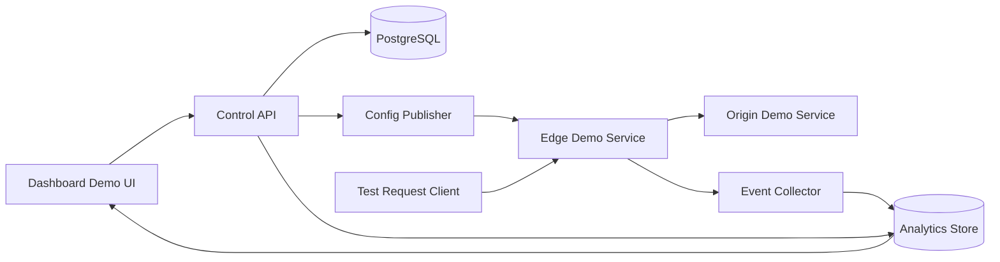

# feat: Build CDN client-winning demo

## Overview

Build a narrow, credible demo for a staged CDN product rather than a broad fake platform. The demo should prove that a customer can walk through domain onboarding UI, use a pre-verified demo domain for live traffic proof, configure one meaningful CDN policy, send traffic through an edge flow, and see measurable outcomes in analytics and quota tracking. The outcome is a sales-quality artifact that demonstrates technical credibility without overclaiming production maturity.

## Problem Frame

The client is not asking for a generic SaaS dashboard. They want confidence that the developer understands how a CDN product actually fits together: control plane, edge behavior, analytics, quotas, and phased rollout. The planned demo must therefore show a real causal chain between configuration and request behavior instead of only polished UI. The demo is scoped to one believable slice of the product and intentionally avoids pretending to be a full Cloudflare-class platform (see origin: `docs/brainstorms/2026-03-30-cdn-client-demo-brainstorm.md`).

## Requirements Trace

- R1. Show a balanced hybrid demo that combines a control-plane surface, a live edge/request story, and an analytics outcome.
- R2. Keep the scope narrow enough to build quickly while still feeling like the first milestone of a serious CDN product.
- R3. Make analytics central to the story by showing bandwidth, cache status/value, regional traffic, and free-plan quota usage.
- R4. Show one clear operational control with observable effect, rather than many shallow settings.
- R5. Include free-plan quota visibility and a visible quota consequence so the commercial model feels real.
- R6. Avoid implying full managed DNS, global scale, or enterprise-grade WAF coverage that the demo does not truly prove.

## Scope Boundaries

- Non-goal: full multi-region infrastructure or anycast networking.
- Non-goal: production-grade managed DNS product.
- Non-goal: enterprise WAF rule catalog, bot protection, or DDoS mitigation.
- Non-goal: real BTCPay billing integration in the first demo unless it is needed for a visible account-balance storyline.
- Non-goal: real-time globally consistent analytics.

## Context & Research

### Relevant Code and Patterns

- The current repo does not contain reusable app structure, implementation patterns, or guidance files, so the plan is self-contained and should establish its own demo boundaries.
- The brainstorm document is the primary source of product intent and already narrows the pitch toward a balanced hybrid demo with analytics as first-class proof.

### Institutional Learnings

- No `docs/solutions/` materials were found in the current repository.

### External References

- Rust Forge CDN overview: emphasizes CDN value around cost reduction, origin offload, and request-path behavior rather than broad feature marketing.
- Stack research: keep a hard separation between Rust edge/data plane and Go control plane; keep PostgreSQL authoritative, Redis ephemeral, and ClickHouse off the serving path.
- Demo best-practice research: the most credible wedge is one real control-plane mutation causing one real data-plane effect with evidence and rollback.
- Flow analysis: the plan must explicitly represent `empty`, `pending setup`, `ready`, `allowed`, `blocked`, `uncached`, `cached`, `quota healthy`, `quota near limit`, and `quota reached` states.

### Planning Posture

- This plan chooses a single demo-build stack for speed: a TypeScript-first monorepo with a Next.js dashboard and small Node-based demo services for control, edge, origin, and analytics behavior.
- The Rust/Go/PostgreSQL/Redis/ClickHouse stack remains the product-direction reference architecture for client discussion, but it is not required for the first client-winning demo.
- The demo must still preserve the same architectural boundaries conceptually: control state authoritative, edge request evaluation separate, analytics derived, and quota enforcement explicit.

## Key Technical Decisions

- Build the demo around one primary narrative: `add domain -> domain ready -> enable cache rule -> send repeated traffic -> observe MISS -> HIT proof -> inspect analytics/quota -> roll back cache rule`. Caching is the primary operational control because it demonstrates core CDN value, produces an easy-to-understand proof loop, and supports clean rollback semantics. WAF remains an explicit secondary path only if time remains after the cache proof is complete.
- Build the demo on one concrete runtime path: a TypeScript dashboard and local demo services, with config propagation implemented as an in-memory publish/apply flow inside the demo environment. This keeps the proof loop buildable while still expressing the intended control-plane to edge separation.
- Define state authority explicitly. Control-plane configuration is the source of truth for domain and policy state, edge request events are the source of truth for request proof, analytics are derived from those events and may lag slightly, and quota enforcement must read from one defined usage state shared by the request path and dashboard messaging. This avoids contradictory UI, proof, and quota outcomes.
- Treat analytics as verification, not the only proof. The dashboard should confirm edge behavior, but the demo must also show request-level evidence such as cache status, request identifier, and revision identifier so the client sees a true control/data-plane connection.
- Show one simple DNS experience for onboarding only, with an explicit readiness contract. `Pending setup` means onboarding instructions are present but the demo tenant is not yet serving traffic. The main walkthrough uses a pre-verified demo domain for live traffic. `Ready` therefore means the pre-verified demo domain has passed the demo readiness check and the edge is allowed to serve the origin. The presenter must explicitly distinguish onboarding UI from live-traffic readiness.
- Treat regional traffic as tertiary context, not core proof. It is optional for the first pass and may appear only as explicitly labeled demo visualization. The core proof path must stand without it.
- Use quota visibility plus quota consequence with a crisp rule. The free plan uses one small demo bandwidth threshold, enforcement occurs in the request path against an authoritative synchronous usage counter, and the quota-reached state returns a clear blocked outcome in both request proof and dashboard messaging. The first pass should show only `healthy -> reached`, not a broader quota mini-product.
- Make truth-labeling a first-class rule. Every proof point shown in the demo must be classified as one of: live proof, derived with bounded lag, seeded demo data, or roadmap/product shape. This labeling rule applies to DNS readiness, analytics freshness, regional traffic, and any quota preparation states.
- Restrict the trust boundary aggressively for the demo. The origin target must be demo-controlled, detailed proof/debug metadata is presenter-only, and only trusted internal emitters can write analytics or quota events.
- Defer BTCPay from the core narrative unless time remains after the primary proof path is working. Billing matters to the overall product, but it is weaker than proving the CDN control/data-plane loop first.

## Open Questions

### Resolved During Planning

- Should the demo be control-plane-led, analytics-led, or both: Use a balanced hybrid that combines both, with analytics supporting the live edge story.
- Should billing be part of the main narrative: No, not for the first pass. Keep billing as optional stretch scope so the primary credibility path stays intact.
- Should quota exhaustion be visible: Yes. The demo should show quota consequence, not just a percentage bar.
- Which operational control anchors the proof loop: caching is primary; WAF is secondary/stretch scope.
- Which walkthrough uses live traffic: the onboarding UI is shown, but live proof runs through a pre-verified demo domain.

### Deferred to Implementation

- Whether the quota consequence is demonstrated by crossing the threshold live or by switching to a prepared `reached` state late in the demo. Both are acceptable only if they use the same synchronous enforcement rule and visible blocked outcome.
- Whether the rollback is exposed as a settings toggle reversal, a config revision restore, or a reset action. The plan only requires a visible rollback path with an observable effect reversal and active-revision confirmation.

## High-Level Technical Design

> *This illustrates the intended approach and is directional guidance for review, not implementation specification. The implementing agent should treat it as context, not code to reproduce.*

The important property is not the exact implementation choice, but the split of responsibilities: the dashboard writes configuration through a control service, the edge service applies that configuration on requests, and analytics are produced from request events rather than hand-maintained UI state.

## Implementation Units

- [ ] **Unit 1: Define the demo narrative and state model**

**Goal:** Establish the exact walkthrough, visible states, labels, and non-goal language so the demo remains coherent and honest.

**Requirements:** R1, R2, R6

**Dependencies:** None

**Files:**
- Create: `docs/demo/demo-script.md`
- Create: `docs/demo/demo-claims-guardrails.md`

**Approach:**
- Write the demo as one primary flow plus three alternate states: onboarding pending, request blocked, and quota reached.
- Define which states are truly live versus derived-with-lag, seeded, or roadmap-only, and require those labels anywhere the distinction matters.
- Lock the language for what the demo claims so later implementation work does not accidentally imply production maturity.
- Define the readiness contract for `pending setup` and `ready`, the cache proof contract for `MISS -> HIT`, and the quota enforcement contract for `healthy -> reached`.
- Add a storyboard table that maps each screen to its primary message, single proof point, and transition to the next screen.
- Add allowed claims, forbidden claims, and standard answers for predictable questions about onboarding realism, global footprint, analytics freshness, WAF maturity, and production readiness.

**Patterns to follow:**
- Use the brainstorm document as the source for scope boundaries and positioning.
- Use the flow-analysis states as the canonical set of visible transitions.

**Test scenarios:**
- Happy path: the written walkthrough covers `empty account -> ready domain -> policy change -> request proof -> analytics -> rollback` with no missing handoff.
- Edge case: alternate states clearly define what the presenter says when the domain is still pending or analytics are not yet populated.
- Error path: the scope document explicitly flags any simulated region or delayed analytics view so the demo does not misrepresent them as live.
- Integration: the state model maps each UI screen to a corresponding control-plane or edge outcome rather than leaving screens disconnected.
- Integration: the state model identifies the authoritative source for config state, request proof, analytics state, and quota state.

**Verification:**
- An implementer can read the demo script and know exactly which screens, states, and proof points must exist before the demo is considered complete.

- [ ] **Unit 2: Build the minimal control-plane dashboard slice**

**Goal:** Create the customer-facing flow for adding a domain, showing onboarding status, and editing the single cache rule that anchors the core proof loop.

**Requirements:** R1, R2, R4, R6

**Dependencies:** Unit 1

**Files:**
- Create: `app/(demo)/domains/page.tsx`
- Create: `app/(demo)/domains/[domainId]/page.tsx`
- Create: `components/demo/domain-onboarding-card.tsx`
- Create: `components/demo/cache-policy-card.tsx`
- Create: `components/demo/domain-readiness-badge.tsx`
- Create: `components/demo/policy-revision-banner.tsx`
- Create: `lib/demo/demo-data.ts`
- Create: `lib/demo/demo-types.ts`
- Test: `tests/demo/dashboard-flow.test.ts`

**Approach:**
- Keep the settings surface intentionally small: one origin target, one cache behavior, one domain status timeline, and one visible active-policy revision indicator.
- Represent domain lifecycle explicitly with `pending setup` and `ready` states so the client sees operational realism.
- Limit this unit to the control-plane screens needed to drive the proof loop; analytics and quota UI beyond the shell belong to Unit 4.
- Treat the dashboard as single-tenant demo access only. Do not add a fake auth flow unless a real auth gate becomes necessary for the presentation environment.

**Patterns to follow:**
- Follow the demo-state model from Unit 1.
- Keep the dashboard talking to a single demo data/service boundary rather than coupling UI directly to edge behavior.

**Test scenarios:**
- Happy path: adding a domain moves the UI from empty account to a domain detail view with onboarding instructions and editable controls.
- Happy path: a ready domain exposes the cache setting and active revision state consistently across screens.
- Edge case: a pending domain prevents the UI from implying live traffic is already flowing.
- Error path: invalid or incomplete onboarding data shows a bounded demo-safe validation state rather than silently proceeding.
- Integration: changing the visible cache control updates the state consumed later by the request proof and analytics views.

**Verification:**
- A viewer can navigate the dashboard and understand domain status, the current cache policy revision, and where proof and analytics evidence will appear.

- [ ] **Unit 3: Implement the cache proof loop before full dashboard breadth**

**Goal:** Back the demo with one request flow where a real configuration change produces a real observable outcome and supports rollback.

**Requirements:** R1, R4, R5

**Dependencies:** Unit 1, Unit 2

**Files:**
- Create: `services/control-api/README.md`
- Create: `services/control-api/src/server.ts`
- Create: `services/control-api/src/domain-state.ts`
- Create: `services/control-api/src/policy-revisions.ts`
- Create: `services/control-api/src/usage-state.ts`
- Create: `services/edge-demo/README.md`
- Create: `services/edge-demo/src/server.ts`
- Create: `services/edge-demo/src/request-evaluator.ts`
- Create: `services/edge-demo/src/cache-store.ts`
- Create: `services/edge-demo/src/event-emitter.ts`
- Create: `services/edge-demo/src/request-normalizer.ts`
- Create: `services/origin-demo/src/server.ts`
- Create: `services/shared/src/types.ts`
- Create: `tests/demo/request-proof.test.ts`
- Create: `tests/demo/rollback-flow.test.ts`
- Test: `tests/demo/policy-publish.test.ts`

**Approach:**
- Implement exactly one control-plane mutation that changes the request path in a visible way: enabling the cache rule for the demo route so repeated requests show `MISS -> HIT`.
- Emit request-level evidence that can be shown in the UI or a debug panel: request identifier, timestamp, active revision identifier, cache result, bytes served, and final disposition.
- Support a rollback action that returns the request path to baseline, proving config reversibility rather than one-way demo scripting.
- Keep the control service authoritative and the edge service stateless beyond cache or short-lived policy state, with explicit apply confirmation before the presenter relies on the next request outcome.
- Bind the edge strictly to the pre-verified demo domain and demo-controlled origin, normalize request inputs before cache decisions, and update authoritative usage state synchronously for quota checks.

**Execution note:** Implement this unit test-first around the observable request outcomes because the credibility of the entire demo depends on this proof loop.

**Technical design:** *(directional guidance, not implementation specification)*
- Control state defines one active policy revision for the demo tenant.
- Edge request evaluation reads the active revision, evaluates the request, emits an event, and returns proof metadata.
- Rollback swaps the active revision back to the previous baseline and the next request reflects that change.

**Patterns to follow:**
- Follow the external research split: control plane owns validation and revisioning; edge plane owns request handling and event emission.
- Keep analytics/event generation off the immediate request decision path except for lightweight event capture.

**Test scenarios:**
- Happy path: first request to a cacheable route returns uncached proof, second identical request returns cached proof.
- Happy path: rolling back the active policy causes the next matching request to return to baseline behavior.
- Edge case: a cold cache after a policy change still returns correct uncached behavior before any cache hit exists.
- Edge case: a domain marked pending setup cannot produce a false `ready` proof result.
- Edge case: a newly published cache revision is not considered live until control state and edge apply confirmation agree on the active revision.
- Edge case: repeated requests before the cache rule is enabled continue to show the baseline uncached behavior so the client can see the toggle caused the change.
- Error path: missing or invalid active policy revision falls back to a safe, explicit demo error state rather than undefined behavior.
- Integration: a policy change made in the dashboard becomes visible in the next request proof without manual data editing.
- Integration: every request proof also produces an analytics/event record consumable by the analytics view.

**Verification:**
- The presenter can perform a live request, point to concrete proof metadata, enable caching, repeat the request, and show `MISS -> HIT` for a real reason with a confirmed active revision.

- [ ] **Unit 4: Add analytics and quota evidence views**

**Goal:** Turn request events into a credible analytics story showing bandwidth, cache behavior, regional distribution, and free-plan quota state.

**Requirements:** R1, R3, R5, R6

**Dependencies:** Unit 2, Unit 3

**Files:**
- Create: `services/analytics/README.md`
- Create: `services/analytics/src/event-ingest.ts`
- Create: `services/analytics/src/usage-rollups.ts`
- Create: `services/analytics/src/quota-state.ts`
- Create: `components/demo/request-proof-panel.tsx`
- Create: `components/demo/analytics-summary-cards.tsx`
- Create: `components/demo/cache-value-card.tsx`
- Create: `components/demo/analytics-page-shell.tsx`
- Create: `components/demo/quota-status-card.tsx`
- Create: `components/demo/quota-threshold-banner.tsx`
- Test: `tests/demo/analytics-story.test.ts`
- Test: `tests/demo/quota-enforcement.test.ts`
- Test: `tests/demo/cache-value-summary.test.ts`

**Approach:**
- Derive analytics from emitted request events so the numbers reinforce the live story instead of competing with it.
- Keep the analytics slice small: total requests, bandwidth consumed, cache hit ratio, cache value/offload estimate, and quota state.
- Use a quota model that makes consequence easy to understand. A tiny demo threshold is acceptable as long as the UI clearly states the free-plan semantics used in the walkthrough and the same quota state drives both messaging and request-path enforcement.
- Treat analytics freshness as bounded lag rather than instant truth; if metrics are delayed, show an explicit `updating` state and rely on request proof as the immediate source of truth.
- If a regional view is later added, it must be labeled as tertiary demo visualization and must never be required for the main proof path.

**Patterns to follow:**
- Analytics serves as verification for the request loop established in Unit 3.
- Follow the planning decision that ClickHouse or any analytics store is not on the serving path; the demo should preserve that logical separation even if the implementation is simplified.

**Test scenarios:**
- Happy path: repeated requests increase request count, bandwidth, and cache-hit ratio in ways consistent with the request proof view.
- Happy path: repeated cache hits increase a visible cache value/offload metric consistent with bytes served from cache.
- Happy path: crossing the quota threshold causes the next request to return the quota-reached outcome and the dashboard to display the same enforcement state.
- Edge case: analytics empty state explains that no traffic has passed yet rather than showing default placeholder values as real data.
- Error path: delayed analytics ingestion shows a bounded `updating` state rather than inconsistent totals.
- Integration: the quota threshold crossing drives a visible product consequence in the dashboard and request flow.
- Integration: analytics totals remain aligned with request-proof events for the demonstrated route.

**Verification:**
- The analytics screen tells one clear story: traffic flowed, the edge behavior mattered, and the free-plan limit is measurable and enforceable.

- [ ] **Unit 5: Package the demo for client presentation**

**Goal:** Make the demo easy to run, narrate, and adapt during a client call without depending on fragile manual setup.

**Requirements:** R2, R5, R6

**Dependencies:** Unit 1, Unit 2, Unit 3, Unit 4

**Files:**
- Create: `docker-compose.yml`
- Create: `docs/demo/runbook.md`
- Create: `docs/demo/presenter-notes.md`
- Create: `docs/demo/fallback-paths.md`
- Create: `docs/demo/presentation-readiness-checklist.md`
- Test: `tests/demo/presentation-readiness.test.ts`

**Approach:**
- Package only the services needed for the demo path so startup remains predictable.
- Write a presenter runbook with the primary flow, alternate flow triggers, and exact fallback stories if a live step fails during the pitch.
- Include explicit language for what is live, what is simulated, and what is next-phase roadmap so the presentation remains technically honest.
- Require a reset and reseed procedure that restores a known baseline, warm-cache state, quota state, and alternate fallback states between rehearsals or client calls.
- Require a short go/no-go checklist covering service health, pre-provisioned ready domain availability, active revision confirmation, cache starting state, quota starting state, analytics freshness, and fallback asset availability.
- Define presenter-safe fallback answers for origin unavailable, publish/apply desync, analytics lag, and onboarding not ready so failure modes do not turn into accidental overclaiming.

**Patterns to follow:**
- Keep deployment packaging aligned with the bounded system defined in earlier units.
- Use the scope and state documents from Unit 1 as the source for presenter language.

**Test scenarios:**
- Happy path: the runbook covers the full primary demo in dependency order with no missing environment or setup assumptions.
- Edge case: the fallback notes cover `domain pending`, `analytics lag`, `quota already reached`, and `WAF block did not trigger` scenarios.
- Edge case: the fallback notes cover `domain pending`, `analytics lag`, `origin unavailable`, and `publish/apply desync` scenarios.
- Error path: if a service is unavailable, the presenter notes provide an honest alternate path instead of relying on improvisation.
- Integration: the packaged environment starts with a clean baseline state and can be reset between presentations.
- Integration: the readiness checklist verifies that dashboard state, edge proof metadata, and active policy revision all agree before the client call begins.

**Verification:**
- Another engineer can run the demo from the runbook and deliver the same core narrative without private context.

## System-Wide Impact

- **Interaction graph:** dashboard state feeds control state; control state feeds edge behavior; edge events feed analytics; analytics and request proof feed the dashboard narrative.
- **Error propagation:** onboarding, policy, or analytics failures should surface as explicit bounded demo states, not as broken pages or silent mismatches.
- **State lifecycle risks:** policy revisions, cache warm/cold state, quota thresholds, and analytics lag all create demo-visible transitions that must be intentionally modeled.
- **API surface parity:** if both UI cards and request-proof panels display policy or quota data, they must derive from the same underlying demo state to avoid contradictions.
- **Integration coverage:** the most important cross-layer checks are config change propagation, request-proof event generation, analytics consistency, and quota consequence behavior.
- **Trust boundaries:** the demo origin is allowlisted, proof metadata is presenter-only, request normalization is explicit, and analytics/quota ingest accepts events only from the trusted edge service.
- **Unchanged invariants:** the demo does not need to change multi-tenant billing logic, global networking behavior, or authoritative DNS semantics to achieve its goal.

## Risks & Dependencies

| Risk | Mitigation |
|------|------------|
| The demo becomes a polished mockup with no real proof loop | Treat Unit 3 as mandatory and gate success on observable request evidence plus rollback |
| The team tries to show too many CDN features and weakens the story | Limit the demo to one domain, one route, one meaningful policy loop, and one analytics storyline |
| Analytics appear fabricated or disconnected from request behavior | Generate analytics from emitted request events and label any simulated aggregates explicitly |
| Quota logic feels cosmetic | Show a visible threshold and a request-path consequence when the limit is reached |
| DNS scope is misunderstood as a full product promise | Keep DNS language and UI framed as onboarding configuration for the demo tenant |
| The primary walkthrough stalls on live onboarding dependencies | Use a pre-provisioned ready domain for the main path and treat `pending setup` as a narrated alternate state |
| Policy changes do not appear on the next request because of publish/apply lag | Require explicit active revision confirmation and pre-demo verification that dashboard state and edge proof agree |
| Demo state drifts between rehearsals because cache, quota, or analytics history are dirty | Add a reset/reseed procedure that restores baseline, warm-cache, near-limit, and reached states deterministically |
| Analytics freshness is too stale for a presentation-safe story | Define bounded freshness expectations and switch to an explicit `updating` or fallback path when totals and request proof diverge |
| A client-facing proof screen accidentally exposes internal or sensitive request details | Keep proof/debug metadata presenter-only and limit stored or displayed request fields to the minimum needed for the story |
| The demo drifts into an open-proxy or fake-origin story | Allow traffic only for the demo-controlled domain and demo-controlled origin |

## Documentation / Operational Notes

- Document exactly which parts of the demo are real, simulated, delayed, or future roadmap.
- Keep presenter notes opinionated about the main story: control-plane action, data-plane effect, analytics confirmation, quota consequence.
- If BTCPay is later added as stretch scope, present it as a separate billing storyline rather than merging it into the core CDN proof path.
- Include a presentation-readiness checklist in the runbook and require it before each rehearsal or client session.
- Require claim guardrails that separate what the software proves from what the future architecture may support later.

## Sources & References

- **Origin document:** `docs/brainstorms/2026-03-30-cdn-client-demo-brainstorm.md`
- External guidance: `https://forge.rust-lang.org/infra/docs/cdn.html`
- Supporting research: stack separation guidance for Rust edge, Go control plane, PostgreSQL, Redis, ClickHouse, and Docker; best-practice guidance for infrastructure demos emphasizing proof and rollback
