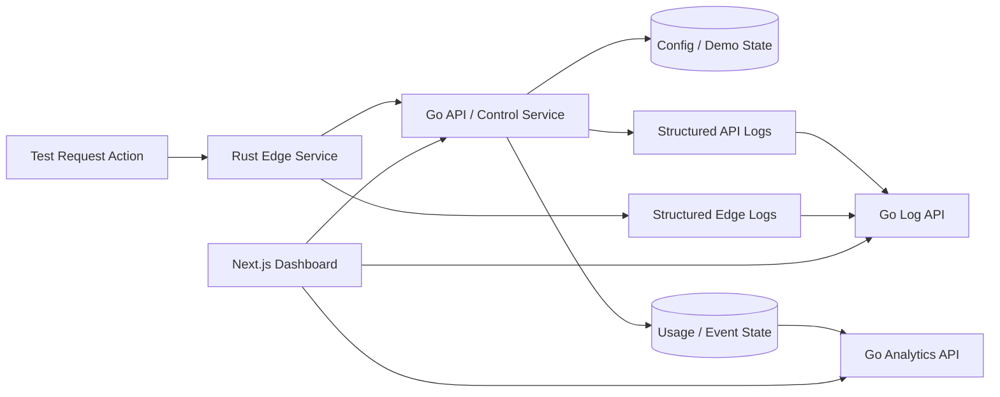

# feat: Add Rust/Go demo clarity path

## Overview

Revise the current CDN demo so it visibly satisfies the client's architectural expectations and fixes the clarity issues found during live review. The next version must keep the narrow proof-loop story, but it can no longer rely on an all-TypeScript simulation for the critical path. A live request should move through a real Rust edge service and a real Go API/control service, while the dashboard makes domain configuration, domain state, and service evidence easy to understand.

## Problem Statement / Motivation

The current demo proves a useful product story, but it misses four buyer-critical points:

1. The client asked for Rust at the edge and Go for the API/control plane, and the current demo does not show either.
2. The domains view is visually repetitive, so it does not communicate meaningful state or capability differences.
3. The domain configuration story is under-specified; the user cannot clearly see what is being configured versus what is just explanatory framing.
4. There is no explicit edge-log or API-log surface, so the architecture is not observable during the demo.

Because this client is evaluating long-term technical credibility, these are not cosmetic gaps. They directly affect whether the demo feels like the first milestone of a serious CDN platform or only a polished frontend prototype.

## Proposed Solution

Keep the dashboard in Next.js/TypeScript, but move the critical proof path onto real service boundaries:

- Rust service owns the edge request evaluation path.
- Go service owns domain/config state, analytics summaries, and service log aggregation for the demo.
- Next.js becomes a UI/proxy layer that renders state from those services and exposes a narrow buyer-facing operations view.

The dashboard should then be revised around three clear surfaces:

1. **Domains**: a differentiated list with meaningful states and a clear path into configuration.
2. **Zone Detail / Configuration**: explicit domain setup, DNS records, origin target, cache policy, and state transitions.
3. **Evidence**: request proof plus separate edge and API log panels, correlated by request ID/trace ID, with analytics remaining the confirmation layer.

## Technical Considerations

- The dashboard should remain on the Node runtime. There is no value in introducing Next Edge runtime constraints into this demo.
- Rust edge should be thin: request normalization, cache decision, quota check, proof/log emission, and forwarding to Go when needed.
- Go should be the contract authority for domain/config state and buyer-facing API surfaces.
- Structured logs and trace correlation should be mandatory for the demo path: `service`, `request_id`, `trace_id`, `domain_id`, `revision_id`, `event`, `outcome`.
- Domain configuration must be scoped to onboarding/product shape, not a full DNS host product.
- The UI should treat proof/logs as low-noise evidence, not a generic observability dashboard.

## Requirements Trace

- R1. Show a real Rust edge service on the live request path.
- R2. Show a real Go API/control service for domain/config and buyer-facing state.
- R3. Make domain configuration visible and understandable without implying a full managed DNS product.
- R4. Differentiate domain states clearly in the domains view and zone detail flow.
- R5. Expose where edge logs and API logs can be seen, with clear purpose boundaries between proof, logs, and analytics.
- R6. Preserve the narrow proof-loop story: config change -> request outcome -> evidence -> quota consequence.
- R7. Keep the demo honest about what is live, what is seeded, and what is future architecture.

## Scope Boundaries

- Non-goal: full production deployment of Rust and Go services.
- Non-goal: full managed DNS product or authoritative DNS hosting.
- Non-goal: broad WAF feature work in this iteration.
- Non-goal: BTCPay or billing integration in this iteration.
- Non-goal: complete distributed tracing UI or a generic ops console.

## Context & Research

### Relevant Code and Patterns

- Current UI routes that should remain the primary shell:
  - `app/page.tsx`
  - `app/domains/page.tsx`
  - `app/domains/[domainId]/page.tsx`
  - `app/domains/new/page.tsx`
  - `app/analytics/page.tsx`
- Current zone composition seam to preserve and deepen:
  - `components/demo/zone-detail-shell.tsx`
- Current domain clarity seam:
  - `components/demo/domain-onboarding-card.tsx`
- Current evidence seam:
  - `components/demo/request-proof-panel.tsx`
- Current simulated service boundaries to replace conceptually with real services:
  - `services/edge-demo/src/*`
  - `services/control-api/src/*`
  - `app/api/request/route.ts`
  - `app/api/policy/route.ts`
  - `app/api/analytics/route.ts`
  - `app/api/reset/route.ts`
- Current in-process demo state to retire from the critical path:
  - `lib/demo/demo-store.ts`

### Institutional Learnings

- The existing brainstorm and first demo plan consistently favor a narrow, causal control-plane to edge proof loop over broad surface area.
- Existing demo docs already emphasize truth-labeling, presenter-safe proof, and scope honesty.

### External References

- Best-practice research: for a technical buyer, make the expected architecture real on the critical path, not just in diagrams.
- Observability research: show only three buyer-facing evidence surfaces when possible: request proof, filtered service logs, and a small confirmation layer.
- Framework/docs research: keep the dashboard on Next.js Node runtime, use Go as the contract authority, and keep Rust edge thin and request-oriented.

## Key Technical Decisions

- Replace the simulated TypeScript-only critical path with a real cross-service path: `Next.js UI -> Go API/control -> Rust edge -> Go API/origin-facing control interactions as needed`. The exact network shape can stay local and simple, but the services must be real.
- Make Rust edge the primary runtime proof of architecture, not just a sidecar. A cache-enabled request must actually execute edge logic in Rust.
- Make Go the authoritative source of domain/config state, analytics summaries, and service-log retrieval APIs.
- Split evidence into three explicit layers:
  - **Request proof**: buyer-readable summary of one request outcome.
  - **Edge logs**: why the edge served, cached, blocked, or forwarded the request.
  - **API logs**: why the control/API service accepted, rejected, or summarized the related state.
- Redesign domain configuration as a task-oriented flow with explicit sections: hostname, origin, onboarding DNS records, readiness status, active revision, and cache policy. Avoid generic card repetition.
- Keep the primary walkthrough anchored on the proof loop. Logs and config views support the story; they do not replace it.
- Use one correlation key across proof, logs, and analytics, such as `request_id` plus `trace_id`, so the buyer can follow one action end to end.
- Explicitly distinguish `expected empty` logs from missing logs. For example, a cache hit may have no API-call log for that request by design.

## Open Questions

### Resolved During Planning

- Should the next revision keep architecture implied or make Rust/Go real: make them real on the critical path.
- Should logs be generic or tied to the proof loop: tie them directly to the proof loop and correlation IDs.
- Should domain configuration stay lightweight: yes, but it must be explicit and understandable.

### Deferred to Implementation

- Whether Rust edge forwards to Go for origin fetch simulation or only for config/policy lookup. The plan only requires a real Rust edge decision path and a real Go API/control path.
- Whether the demo uses REST/JSON only between services or also adopts a schema layer such as Buf-managed protobufs. This can be decided during implementation based on speed and clarity.
- Whether traces are shown in a custom dashboard panel or only exposed through correlated log fields and request proof. The buyer-visible requirement is correlation, not a full tracing product.

## High-Level Technical Design

> *This illustrates the intended approach and is directional guidance for review, not implementation specification. The implementing agent should treat it as context, not code to reproduce.*

## Implementation Phases

### Phase 1: Restore Architecture Credibility

- Introduce a real Rust edge service and real Go API/control service into the demo workspace.
- Turn the existing Next.js API routes into thin proxies or remove them in favor of direct dashboard-to-Go access where appropriate.
- Preserve the existing UI shell while replacing the in-process critical-path simulation.

### Phase 2: Clarify Domain Configuration and States

- Redesign the domains page and zone detail around visible state, setup tasks, and distinct next actions.
- Add explicit domain configuration sections with clear boundaries between onboarding records, origin settings, and live-readiness state.

### Phase 3: Add Buyer-Facing Evidence Surfaces

- Add request proof, edge logs, and API logs with shared request correlation.
- Tighten analytics so it remains a confirmation layer and does not contradict logs or proof.

## Implementation Units

- [ ] **Unit 1: Introduce real Rust edge and Go API services**

**Goal:** Replace the TypeScript-only critical path with real service boundaries that satisfy the client’s architecture requirement.

**Requirements:** R1, R2, R6, R7

**Dependencies:** None

**Files:**
- Create: `edge-rust/Cargo.toml`
- Create: `edge-rust/src/main.rs`
- Create: `edge-rust/src/request_flow.rs`
- Create: `edge-rust/src/logging.rs`
- Create: `api-go/go.mod`
- Create: `api-go/cmd/server/main.go`
- Create: `api-go/internal/domains/service.go`
- Create: `api-go/internal/policy/service.go`
- Create: `api-go/internal/logs/service.go`
- Create: `api-go/internal/analytics/service.go`
- Modify: `app/api/request/route.ts`
- Modify: `app/api/policy/route.ts`
- Modify: `app/api/analytics/route.ts`
- Modify: `app/api/reset/route.ts`
- Test: `tests/demo/request-proof.test.ts`
- Test: `tests/demo/policy-publish.test.ts`

**Approach:**
- Keep Next.js as UI only and move critical path behavior behind real local services.
- Rust edge handles request evaluation, cache/bypass/block decisioning, proof metadata emission, and edge log emission.
- Go handles domain/config state, policy publishing, analytics rollups, reset flows, and API log emission.
- Next route handlers may stay temporarily as thin proxies to reduce frontend churn, but they must stop owning business logic.

**Test scenarios:**
- Happy path: publishing a cache rule through the UI reaches the Go service and affects the next Rust edge request.
- Happy path: a repeated request shows baseline, miss, and hit through the real Rust edge path.
- Edge case: a ready domain can serve traffic while a pending domain cannot.
- Error path: if Go is unavailable, the dashboard shows a bounded config/service error rather than silently falling back to in-process state.
- Integration: request proof fields shown in the UI are produced by Rust and retrieved through the real service boundary.

**Verification:**
- A presenter can credibly state that the dashboard is TypeScript, the edge path is Rust, and the control/API service is Go because one request actually traverses those runtimes.

- [ ] **Unit 2: Redesign domain list and configuration flow for clarity**

**Goal:** Make it obvious how a user configures a domain and what state each domain is in.

**Requirements:** R3, R4, R6, R7

**Dependencies:** Unit 1

**Files:**
- Modify: `app/domains/page.tsx`
- Modify: `app/domains/[domainId]/page.tsx`
- Modify: `components/demo/domain-onboarding-card.tsx`
- Modify: `components/demo/domain-readiness-badge.tsx`
- Modify: `components/demo/policy-revision-banner.tsx`
- Create: `components/demo/domain-config-sections.tsx`
- Create: `components/demo/domain-state-timeline.tsx`
- Test: `tests/demo/dashboard-flow.test.tsx`

**Approach:**
- Replace repetitive domain cards with differentiated rows/cards showing hostname, state, origin, live-readiness, active revision, and next action.
- Make the zone detail page explain domain configuration in explicit sections: DNS records, origin target, proxy status, readiness contract, and cache policy.
- Add clear language for `pending`, `ready`, `blocked`, and any degraded states used in the demo.
- Ensure the UI distinguishes `configured` from `live` so the buyer understands what is ready for traffic.

**Test scenarios:**
- Happy path: a ready domain clearly shows it can enter the live proof path.
- Happy path: a pending domain clearly shows what remains to be configured.
- Edge case: an empty domains view guides the presenter toward creating a ready or pending domain with different consequences.
- Error path: invalid or duplicate domain input returns a bounded validation state.
- Integration: state shown in the domains list matches the zone detail and Go service response.

**Verification:**
- A viewer can answer “what is configured here?” and “what is this domain’s state?” without presenter translation.

- [ ] **Unit 3: Add explicit edge-log and API-log evidence surfaces**

**Goal:** Show where the edge and API service logs can be seen without overwhelming the buyer.

**Requirements:** R5, R6, R7

**Dependencies:** Unit 1, Unit 2

**Files:**
- Modify: `components/demo/request-proof-panel.tsx`
- Modify: `components/demo/zone-detail-shell.tsx`
- Create: `components/demo/edge-log-panel.tsx`
- Create: `components/demo/api-log-panel.tsx`
- Create: `components/demo/evidence-tabs.tsx`
- Create: `app/api/logs/route.ts`
- Test: `tests/demo/request-proof.test.ts`
- Test: `tests/demo/analytics-story.test.ts`

**Approach:**
- Keep request proof as the primary evidence surface.
- Add secondary log panels for edge logs and API logs, filtered to the active request and current tenant.
- Use correlated fields so the buyer can map one action across proof and both log streams.
- Define and label expected-empty states, especially when a cache hit should not produce a new API activity log.

**Test scenarios:**
- Happy path: a baseline request shows proof plus a matching edge log and API log.
- Happy path: a cache hit shows proof and edge log evidence, while the API log surface explains why it may be empty or unchanged.
- Edge case: a blocked request surfaces correctly across proof, edge logs, API logs, and quota state.
- Error path: if one log stream is unavailable, the UI shows a bounded degraded-observability state without breaking the proof loop.
- Integration: request ID and trace ID shown in proof match the entries rendered in both log panels.

**Verification:**
- The answer to “where do I see the edge logs and API logs?” is visible in the zone detail page and tied to one request story.

- [ ] **Unit 4: Reconcile analytics and quota with the new service-backed evidence path**

**Goal:** Preserve analytics and quota credibility after moving to Rust/Go-backed flows.

**Requirements:** R2, R5, R6, R7

**Dependencies:** Unit 1, Unit 3

**Files:**
- Modify: `app/analytics/page.tsx`
- Modify: `components/demo/analytics-page-shell.tsx`
- Modify: `components/demo/analytics-summary-cards.tsx`
- Modify: `components/demo/cache-value-card.tsx`
- Modify: `components/demo/quota-status-card.tsx`
- Modify: `components/demo/quota-threshold-banner.tsx`
- Test: `tests/demo/quota-enforcement.test.ts`
- Test: `tests/demo/cache-value-summary.test.ts`

**Approach:**
- Keep analytics as a confirmation layer fed by Go summaries that aggregate the new service-backed events.
- Preserve the simple free-plan rule, but make sure blocked outcomes, cache value, and request totals remain consistent with edge and API evidence.
- Add bounded stale/loading states if summaries lag behind request proof.

**Test scenarios:**
- Happy path: request proof, logs, analytics, and quota tell a consistent story after cache enablement.
- Happy path: quota reached blocks the next request and the same blocked state appears in analytics.
- Edge case: a cache hit increments the correct counters while leaving API activity intentionally minimal.
- Error path: delayed analytics summary shows an explicit stale/updating state.
- Integration: analytics values come from the Go service rather than in-process UI state.

**Verification:**
- The analytics view still works as the buyer-facing confirmation layer after the service split.

- [ ] **Unit 5: Add demo operations affordances for rehearsal and explanation**

**Goal:** Make the revised multi-service demo easy to operate during a pitch.

**Requirements:** R6, R7

**Dependencies:** Unit 1, Unit 2, Unit 3, Unit 4

**Files:**
- Modify: `docs/demo/demo-script.md`
- Modify: `docs/demo/demo-claims-guardrails.md`
- Create: `docs/demo/service-map.md`
- Create: `docs/demo/logs-and-evidence-guide.md`
- Create: `docs/demo/runbook.md`
- Create: `docker-compose.yml`
- Test: `tests/demo/presentation-readiness.test.ts`

**Approach:**
- Document exactly what is now real in Rust and Go.
- Add a simple service map for the buyer and a presenter-only operations guide for reset, startup, and evidence interpretation.
- Include reset/reseed steps and what to say when API logs are intentionally empty for cache hits.

**Test scenarios:**
- Happy path: the runbook explains startup and the main proof flow in dependency order.
- Edge case: the docs explain pending-domain, expected-empty API logs, and stale analytics states clearly.
- Error path: if one service is unavailable, the runbook gives an honest fallback narrative.
- Integration: the presentation guide matches the actual UI surfaces and service boundaries.

**Verification:**
- Another engineer can start the services and explain the architecture honestly during a client call.

## Success Metrics

- A reviewer can identify the Rust edge, Go API/control service, and Next.js dashboard from the running demo itself.
- The domains page and zone detail make domain configuration understandable without external explanation.
- The zone detail page answers where to see edge logs and API logs.
- The primary proof loop remains visible and easier to follow, not more cluttered.

## Dependencies & Risks

| Risk | Mitigation |
|------|------------|
| Adding real Rust and Go services slows delivery too much | Keep the service scope narrow: one request path, one domain flow, one evidence loop |
| The demo becomes an observability console instead of a product demo | Keep request proof primary and logs secondary, filtered, and low-noise |
| Domain configuration expands into a fake DNS product | Limit the configuration view to onboarding records, origin target, readiness, and policy |
| Cross-service state becomes inconsistent | Make Go the authority for config/state and use shared request correlation across surfaces |
| Cache hits confuse buyers because API logs may be absent | Add explicit expected-empty messaging in the API log panel |
| The architecture is still questioned during review | Document the service map and expose runtime-specific log surfaces clearly in the UI |

## References & Research

- Brainstorm: `docs/brainstorms/2026-03-30-cdn-client-demo-brainstorm.md`
- Existing plan: `docs/plans/2026-03-30-001-feat-cdn-demo-plan.md`
- Current demo docs: `docs/demo/demo-script.md`, `docs/demo/demo-claims-guardrails.md`
- Relevant current seams: `app/domains/page.tsx`, `app/domains/[domainId]/page.tsx`, `components/demo/zone-detail-shell.tsx`, `components/demo/domain-onboarding-card.tsx`, `components/demo/request-proof-panel.tsx`
- External guidance: `https://forge.rust-lang.org/infra/docs/cdn.html`
