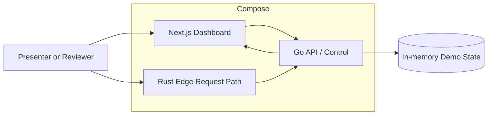

# feat: Package demo and add guided onboarding with basic WAF

## Overview

Package the current Rust edge, Go API/control, and Next.js dashboard demo into a reproducible Docker Compose setup, replace the current shortcut-style domain creation flow with a clearer guided onboarding flow, and add one deliberately narrow WAF proof path to the Rust edge. The result should make the demo easier to run, easier to hand off, and more credible for a buyer who wants to see how a customer would configure a domain and how a basic protection rule would affect live traffic.

## Problem Statement / Motivation

The current demo now proves the architecture split well, but three gaps remain in the client-facing story:

1. It still depends on local dev startup knowledge rather than a portable, one-command packaging story.
2. The current `/domains/new` flow is only a shortcut that auto-creates a pending or ready demo domain, so it does not feel like a real user onboarding path.
3. The demo shows cache and quota behavior, but it still lacks even a minimal protection-control story such as a basic WAF decision on the edge.

These gaps matter because the next review is likely to ask not only "does the architecture exist?" but also "could a user actually get onboarded?" and "what else can the edge enforce besides caching?" The next iteration should answer both without diluting the existing cache-proof loop or pretending to offer a full security product.

## Proposed Solution

Build the next iteration around three bounded additions:

- **Compose packaging**: add container packaging for the existing three-service demo so another engineer can run the full stack with Docker Compose and reach the same walkthrough reliably.
- **Guided onboarding**: replace the current auto-create route with a task-oriented domain onboarding form and detail flow that collects hostname, origin, onboarding mode, and readiness expectations explicitly.
- **Basic WAF proof loop**: add one buyer-readable WAF rule, enforced in Rust, with correlated proof/log/analytics outcomes visible in the existing evidence surfaces.

The main narrative should remain: `create or review domain -> publish cache/WAF policy -> send request -> inspect proof/logs -> observe analytics/quota`. Caching remains the primary value story. WAF is an adjacent control that proves the edge can also block traffic for a specific, visible reason.

## Technical Considerations

- Docker Compose should package the current local architecture, not redesign it.
- The Go service should remain the source of truth for domain, policy, proof, log, and analytics state.
- The Rust service should remain the enforcement point for request-path decisions, including the new WAF check.
- The onboarding flow should support both `pending` and `ready` demo modes, but should present them as explicit demo choices rather than hidden URL behavior.
- WAF must stay intentionally narrow: one small rule model, one visible block reason, one corresponding analytics/log story.
- The demo must stay honest: this is a basic request filter, not a production WAF catalog.

## Requirements Trace

- R1. Provide a reproducible local deployment path for the existing three-service demo using Docker Compose.
- R2. Replace the current shortcut-based domain creation flow with a clear user-facing onboarding flow.
- R3. Let a user configure hostname, origin, and onboarding/readiness mode explicitly without implying full managed DNS automation.
- R4. Add one simple WAF rule path enforced in the Rust edge service.
- R5. Show WAF outcomes clearly in request proof, edge logs, API logs, and analytics.
- R6. Preserve the current cache proof loop and quota story.
- R7. Keep the demo honest about what is live, what is demo-configured, and what is future scope.

## Scope Boundaries

- Non-goal: Kubernetes, cloud deployment, or production orchestration.
- Non-goal: persistent production databases or external object/cache stores.
- Non-goal: automated DNS verification against a real provider.
- Non-goal: generalized rule builder, managed rules catalog, bot protection, or DDoS mitigation.
- Non-goal: account auth, multi-tenant organizations, or billing changes in this iteration.
- Non-goal: auto-committing or shipping changes as part of the implementation itself. Commit work remains a user-invoked step.

## Context & Research

### Relevant Code and Patterns

- Current domain creation is only a redirecting shortcut in `app/domains/new/page.tsx`.
- Current onboarding display already has a useful framing seam in `components/demo/domain-onboarding-card.tsx`.
- Current zone composition already has the right extension point for extra controls and evidence in `components/demo/zone-detail-shell.tsx`.
- Go currently owns domain creation, policy mutation, analytics, logs, proofs, reset, and edge context through `api-go/internal/http/handlers.go`.
- Shared type boundaries already exist in `services/shared/src/types.ts` and `api-go/internal/state/types.go`.
- Rust request evaluation already owns blocking and cache behavior in `edge-rust/src/request_flow.rs`.
- Current run instructions are documented in `docs/demo/runbook.md`, but they still assume local toolchains instead of container packaging.

### Institutional Learnings

- The prior plans already established that the demo wins by showing one real control-plane mutation causing one real edge outcome.
- The architecture-clarity pass established that proof, edge logs, API logs, and analytics should stay tightly correlated rather than expanding into a generic ops product.
- The existing demo already distinguishes `pending` and `ready`; this iteration should deepen that distinction into a real onboarding flow rather than inventing new domain states.

### External References

- Docker Compose is appropriate here because the system is still a local three-service demo with stable ports and no production orchestration requirement.
- CDN demo best-practice guidance still applies: prefer one observable rule with one observable outcome over a wide but shallow settings surface.
- WAF demo best-practice guidance: show a narrow, explainable block rule with a clear reason rather than many fake protections.

## Key Technical Decisions

- Add `Dockerfile`s for the Next.js UI, Go API, and Rust edge, and add a root `docker-compose.yml` that wires those services together on the same local network with the same user-facing ports where practical. Compose is a packaging layer for the existing architecture, not a new runtime model.
- Keep the Go service as the authority for domain config and policy state. Compose should not introduce a new persistence model unless necessary for startup correctness.
- Replace the current `app/domains/new/page.tsx` auto-create redirect with a real page that renders a form and posts a richer domain-creation payload to Go.
- Extend the domain model to store onboarding inputs explicitly, at minimum hostname, origin, demo mode, and an optional initial protection policy shape. Any additional fields should be justified by the live walkthrough, not by future product imagination.
- Represent onboarding in a user-readable sequence: enter hostname, set origin, review DNS records, choose demo state, confirm result. The UI should explain why a domain is still pending versus ready.
- Add one basic WAF rule to the policy model. The minimal rule should be something the buyer can understand immediately, such as `block a specific path prefix` or `block requests carrying a specific header`. Path-prefix blocking is the simplest option because it is easy to exercise from the current request form and easy to show in proof/logs.
- Keep cache and WAF in one policy surface, but visually separate them so the buyer understands they are different edge controls.
- Extend request proof status vocabulary carefully. It should remain compact and buyer-readable, for example by adding a WAF-specific blocked state rather than inventing a large taxonomy.
- Keep analytics as the confirmation layer. WAF needs only minimal derived metrics, such as blocked-request count, and must not complicate the existing quota math.
- Treat commit/push as an operational follow-up, not part of the technical implementation scope. If the user later asks to commit, use the finished diff and the repo’s commit flow then.

## Open Questions

### Resolved During Planning

- Should Docker Compose replace the current dev workflow: no. It should supplement it with a reproducible packaging path.
- Should the onboarding flow continue using hidden URL modes: no. The mode should be selected explicitly in the UI.
- Should the WAF scope be broad: no. One clear rule is enough for this iteration.

### Deferred to Implementation

- Whether the basic WAF rule should be path-based or header-based. Path-based blocking is recommended because it is simplest to demonstrate using the existing request path input.
- Whether Compose should mount source for live reload or target a presentation-ready static build/start flow. The plan supports either, but the default should optimize for reproducibility over hot reload.
- Whether the onboarding form should support editing an existing domain immediately after creation or only initial creation in this pass.

## High-Level Technical Design

> *This illustrates the intended approach and is directional guidance for review, not implementation specification. The implementing agent should treat it as context, not code to reproduce.*

The important property is unchanged: the dashboard writes and reads through Go, the Rust edge enforces request behavior, and all user-visible proof remains correlated across services. Compose only makes that system portable and repeatable.

## Implementation Phases

### Phase 1: Package the existing multi-service demo

- Add container packaging for UI, Go, and Rust.
- Add Compose orchestration and update runbook instructions.
- Verify the current cache/quota flow still works under Compose.

### Phase 2: Replace shortcut domain creation with guided onboarding

- Add a real onboarding page and richer create-domain API contract.
- Update the domain detail view to reflect the richer onboarding inputs.
- Preserve `pending` and `ready` demo states, but make them explicit user choices.

### Phase 3: Add a basic WAF proof loop

- Extend policy state and UI controls for one simple WAF rule.
- Enforce the rule in Rust.
- Surface WAF outcomes in proof, logs, and analytics.

## Implementation Units

- [ ] **Unit 1: Package the existing demo with Docker Compose**

**Goal:** Make the current Next.js, Go, and Rust services runnable through a reproducible Compose workflow.

**Requirements:** R1, R6, R7

**Dependencies:** None

**Files:**
- Create: `Dockerfile.ui`
- Create: `api-go/Dockerfile`
- Create: `edge-rust/Dockerfile`
- Create: `docker-compose.yml`
- Modify: `package.json`
- Modify: `docs/demo/runbook.md`
- Modify: `docs/demo/service-map.md`

**Approach:**
- Package the UI, Go API, and Rust edge as three explicit services.
- Use environment variables or service-host defaults so the containers can talk to one another without hardcoded `127.0.0.1` assumptions.
- Keep the external ports aligned with the existing docs if possible: UI `3000`, Go `4001`, Rust `4002`.
- Add a Compose-friendly startup command that favors repeatability and client-demo readiness over dev hot reload.
- Update runbook steps to show both the current local-toolchain flow and the new Compose flow.

**Test scenarios:**
- Happy path: `docker compose up` starts all three services and the main walkthrough still works.
- Edge case: one service starting late does not silently break the demo without a visible health-check failure.
- Error path: misconfigured inter-service URLs fail with clear startup or health errors rather than hidden dashboard fallbacks.
- Integration: policy publish, request proof, logs, analytics, and reset all still function through the composed stack.

**Verification:**
- Another engineer can start the demo with Docker Compose and reach the same cache-proof flow without local language-specific startup steps.

- [ ] **Unit 2: Replace shortcut domain creation with a guided onboarding flow**

**Goal:** Make domain creation look and behave like a real user workflow instead of a hidden demo shortcut.

**Requirements:** R2, R3, R7

**Dependencies:** Unit 1

**Files:**
- Modify: `app/domains/new/page.tsx`
- Create: `components/demo/domain-onboarding-form.tsx`
- Modify: `components/demo/domain-onboarding-card.tsx`
- Modify: `components/demo/domain-config-sections.tsx`
- Modify: `services/shared/src/types.ts`
- Modify: `api-go/internal/state/types.go`
- Modify: `api-go/internal/http/handlers.go`
- Modify: `lib/demo/service-client.ts`
- Test: `tests/demo/dashboard-flow.test.tsx`

**Approach:**
- Replace the current auto-create redirect with a rendered form that collects hostname, origin, and demo mode.
- Generate and show onboarding DNS records based on the submitted hostname rather than only returning pre-shaped demo values.
- Keep the domain modes simple: `ready` for the live proof path and `pending` for the onboarding-shape path.
- Preserve demo safety by constraining origin choices if needed, but make the UI explicit about any demo-only restrictions.
- Update the zone detail page so the onboarding card and configuration sections reflect the user-provided inputs and next actions.

**Test scenarios:**
- Happy path: a user can create a ready domain through the form and land on a usable zone detail page.
- Happy path: a user can create a pending domain and clearly see why traffic is blocked.
- Edge case: invalid hostname or missing origin produces a bounded validation state.
- Edge case: duplicate domain creation is handled explicitly rather than silently generating overlapping demo records.
- Integration: the created domain state shown in the form, domains list, and zone detail all match the Go service response.

**Verification:**
- A viewer can understand how a user would onboard a domain without needing the presenter to explain a hidden shortcut.

- [ ] **Unit 3: Extend policy state with one basic WAF rule**

**Goal:** Add one simple protection control to the existing policy model without broadening the demo into a fake security product.

**Requirements:** R4, R6, R7

**Dependencies:** Unit 2

**Files:**
- Modify: `services/shared/src/types.ts`
- Modify: `api-go/internal/state/types.go`
- Modify: `api-go/internal/http/handlers.go`
- Modify: `api-go/internal/state/store.go`
- Modify: `components/demo/cache-policy-card.tsx`
- Create: `components/demo/waf-policy-card.tsx`
- Modify: `components/demo/zone-detail-shell.tsx`
- Test: `tests/demo/policy-publish.test.ts`

**Approach:**
- Extend the active policy revision to include one WAF field, preferably a path-prefix block rule and an enabled/disabled flag.
- Keep the UI narrow: one card or section that explains the rule, the target path, and the effect when enabled.
- Preserve the current cache controls and revision flow so WAF and cache can coexist on the same revision history.
- Make the WAF language explicit: this is a basic demo rule evaluated at the edge, not a full managed rules engine.

**Test scenarios:**
- Happy path: enabling the WAF rule publishes a new revision visible in the UI and available to Rust edge evaluation.
- Edge case: disabling the WAF rule returns traffic to the previous served behavior.
- Error path: invalid WAF rule input is rejected by Go with a bounded validation error.
- Integration: cache settings and WAF settings remain consistent within the same active revision.

**Verification:**
- The UI can show one real protection rule as part of the existing policy story without cluttering the domain view.

- [ ] **Unit 4: Enforce the WAF rule in Rust and surface the outcome in evidence**

**Goal:** Make the new WAF rule produce a real edge block decision with visible proof and logs.

**Requirements:** R4, R5, R6

**Dependencies:** Unit 3

**Files:**
- Modify: `edge-rust/src/request_flow.rs`
- Modify: `edge-rust/src/main.rs`
- Modify: `services/shared/src/types.ts`
- Modify: `components/demo/request-proof-panel.tsx`
- Modify: `components/demo/edge-log-panel.tsx`
- Modify: `components/demo/api-log-panel.tsx`
- Test: `tests/demo/request-proof.test.ts`
- Test: `tests/demo/analytics-story.test.ts`

**Approach:**
- Evaluate the WAF rule before cache behavior so a blocked request never enters the cache path.
- Add one explicit blocked outcome for WAF and ensure the proof message names the rule reason clearly.
- Emit correlated edge logs that explain the block and API logs that show the policy revision that enabled it.
- Keep expected-empty log behavior intact where appropriate; a WAF block should still be easy to trace without creating noisy unrelated API activity.

**Test scenarios:**
- Happy path: a request to the blocked path returns a WAF-blocked proof result from Rust.
- Happy path: a normal request continues to show bypass, miss, or hit behavior when the WAF rule does not match.
- Edge case: a pending domain still shows pending-block behavior before any WAF evaluation if that remains the intended precedence.
- Edge case: quota-reached behavior and WAF behavior have a defined precedence and never contradict each other.
- Integration: request proof, edge logs, and API logs all show the same request ID, revision ID, and WAF outcome.

**Verification:**
- A presenter can enable the WAF rule, send a matching request, and show a real Rust-edge block reason tied to the active revision.

- [ ] **Unit 5: Add minimal WAF analytics and presentation guidance**

**Goal:** Fold the new WAF behavior into the buyer-facing confirmation and operating docs without overwhelming the story.

**Requirements:** R5, R6, R7

**Dependencies:** Unit 4

**Files:**
- Modify: `app/analytics/page.tsx`
- Modify: `components/demo/analytics-page-shell.tsx`
- Modify: `components/demo/analytics-summary-cards.tsx`
- Modify: `docs/demo/demo-script.md`
- Modify: `docs/demo/demo-claims-guardrails.md`
- Modify: `docs/demo/logs-and-evidence-guide.md`
- Modify: `docs/demo/runbook.md`
- Test: `tests/demo/presentation-readiness.test.ts`

**Approach:**
- Add only the smallest analytics extension needed, such as a blocked-request count that includes WAF outcomes.
- Update the runbook with a second short walkthrough: enable rule, hit blocked path, inspect proof/logs, return to normal path.
- Update claims guardrails to state clearly that the demo proves one edge block rule, not a complete WAF product.
- Keep the main presentation sequence centered on caching, with WAF as a short adjacent capability demo.

**Test scenarios:**
- Happy path: analytics, proof, and logs remain consistent after a WAF-blocked request.
- Edge case: the docs explain how WAF and cache relate so the presenter does not imply blocked traffic was cached.
- Error path: if analytics lag after a WAF block, the runbook points the presenter back to request proof and logs as the primary evidence.
- Integration: the updated demo script matches the actual onboarding, Compose, cache, and WAF flows.

**Verification:**
- Another engineer can run the demo, onboard a domain, show cache behavior, show a basic WAF block, and explain the boundaries honestly.

## Success Metrics

- The demo can be started through Docker Compose and passes the same core walkthrough.
- The `/domains/new` experience feels like a user workflow rather than a hidden demo shortcut.
- A buyer can see one real WAF-style edge block reason in request proof and logs.
- The WAF addition does not obscure or break the cache-proof and quota stories.

## Dependencies & Risks

| Risk | Mitigation |
|------|------------|
| Compose packaging drifts from the current working local setup | Reuse the existing three-service topology and ports, and verify the current walkthrough unchanged before adding new features |
| The onboarding flow becomes too ambitious | Limit it to hostname, origin, mode, DNS instructions, and readiness explanation |
| WAF scope expands into a fake product surface | Permit only one rule type and one clear blocked outcome in this iteration |
| Policy state becomes harder to understand once cache and WAF share revisions | Keep the UI split into separate cards with one shared revision banner |
| Request precedence becomes confusing between pending, quota, and WAF blocks | Define precedence explicitly during implementation and cover it with tests |
| Hardcoded local URLs break inside containers | Move service endpoints behind environment-aware configuration before verifying Compose |
| The presenter overclaims the WAF story | Update claim guardrails and runbook language to keep the scope narrow and explicit |

## References & Research

- Prior architecture plan: `docs/plans/2026-03-30-002-feat-rust-go-demo-clarity-plan.md`
- Prior main demo plan: `docs/plans/2026-03-30-001-feat-cdn-demo-plan.md`
- Current run instructions: `docs/demo/runbook.md`
- Current creation shortcut: `app/domains/new/page.tsx`
- Current Rust edge decision path: `edge-rust/src/request_flow.rs`
- Current Go API surface: `api-go/internal/http/handlers.go`
