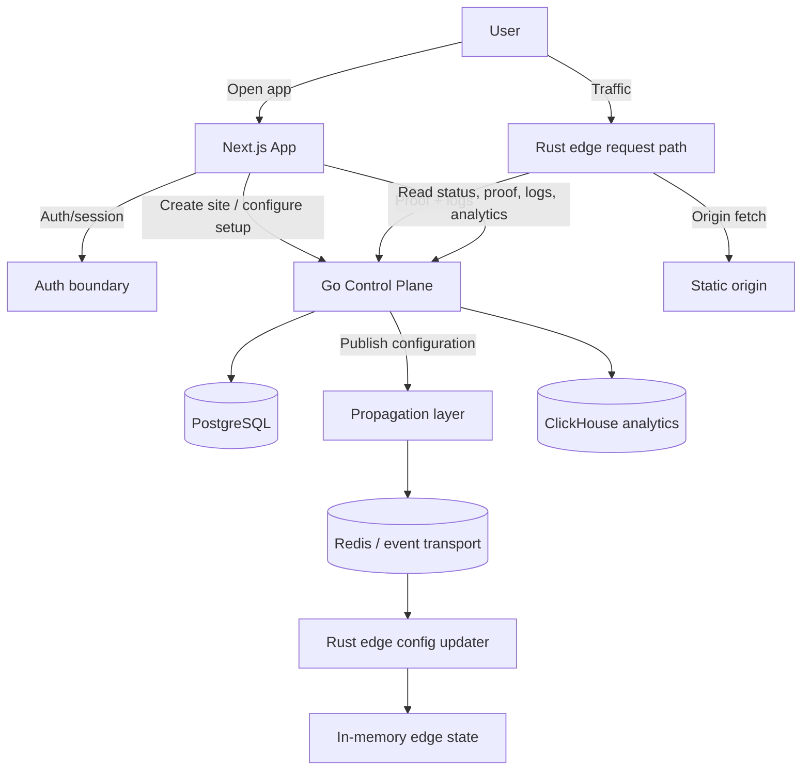

# feat: Real User CDN Onboarding and Setup Flow

## Enhancement Summary

**Deepened on:** 2026-03-31  
**Sections enhanced:** 10  
**Primary research inputs:** repo structure analysis, user-flow analysis, product review, design review, security review, testing review, framework guidance, current CDN onboarding best practices

### Key Improvements
1. Reframes the work around a real user journey instead of internal propagation mechanics.
2. Defines the complete onboarding flow from login to first live CDN proof.
3. Separates user-facing setup phases from backend propagation implementation details.
4. Adds concrete state models, acceptance criteria, security decisions, and test strategy for a buyer-complete setup flow.

### New Considerations Discovered
- The current repo already has strong seams for domain setup, policy publishing, proof, logs, and analytics; the new plan should extend those surfaces instead of replacing them.
- DNS verification, origin validation, auth/session behavior, and “saved vs active at edge” state are the main missing pieces for a real user setup experience.
- Redis Streams, outbox, and lock-free edge propagation remain useful, but they should sit behind the product flow instead of defining it.

## Overview

Build a real user CDN setup journey where someone can arrive at the product, log in, create a site, connect or deploy a simple static origin, configure core CDN behavior, verify readiness, activate the domain through the CDN, and confirm with real request proof that traffic is flowing through the edge.

This plan does **not** replace the infrastructure work captured in `docs/plans/2026-03-31-feat-e2e-cdn-integration-plan.md`. That plan remains the implementation path for durable propagation, edge runtime correctness, and event-driven synchronization. This plan defines the **user-facing workflow** that those internals must support.

## Problem Statement

The current product and plans are still too centered on demo/operator flow and infrastructure mechanics. A real user trying to set up the CDN still lacks a complete, self-explanatory journey that answers:

1. How do I start and authenticate?
2. How do I add my domain and connect an origin?
3. What DNS or proxy steps remain before traffic can go live?
4. When I click publish or activate, is the configuration only saved or actually live at the edge?
5. How do I prove the CDN is working on real traffic once setup is complete?

The system needs a product flow that gets a user from zero to “my CDN is configured and active” without depending on presenter narration or internal architecture knowledge.

## Goals

1. Create a real onboarding and setup flow for an end user, not only a demo operator.
2. Support a simple, convincing “first success” path for a static site or static origin.
3. Preserve the current proof/log/analytics loop as the final confidence moment.
4. Make every setup state explicit: incomplete, verifying, applying, active, degraded, or blocked.
5. Keep the architecture honest: request proof and logs are immediate truth, analytics are confirmation.

## Non-Goals

1. Replacing or deleting the Redis Streams / outbox integration plan.
2. Designing full enterprise account, billing, organization, or RBAC systems.
3. Shipping fully automated production-grade DNS providers, managed nameserver migration, or full deployment platform breadth in this phase.
4. Turning Nginx into the real edge logic layer.
5. Claiming global production readiness beyond what the existing stack actually supports.

## Proposed User Journey

### Phase 0: Entry and Authentication

The user arrives on a landing or app entry page, signs in, and lands in the authenticated setup surface.

**Required outcomes:**
- The app distinguishes unauthenticated and authenticated states clearly.
- The first authenticated screen routes the user toward domain/site setup, not internal demo controls.
- If auth remains simplified in the first implementation, the plan must still define the future auth boundary and the setup flow as if a real session exists.

### Phase 1: Create Site / Add Domain

The user creates a CDN site by entering:
- hostname/domain
- project/site label
- onboarding path

Supported onboarding paths in MVP:
1. **Existing static origin**: user provides a reachable origin URL.
2. **Simple static origin**: user uploads or provisions a minimal static site through the app.
3. **Demo-assisted static origin**: explicitly labeled fallback path for a seeded simple origin when productized deploy is not yet complete.

**Required outcomes:**
- A domain record is created in Go control-plane state.
- The user is redirected to a setup workspace for that specific domain.
- The app shows what setup steps remain.

### Phase 2: Connect or Deploy Origin

The user either connects an existing origin or creates a simple static origin.

For an existing origin:
- validate URL shape
- validate protocol/port policy
- run reachability and health checks

For a simple static origin:
- provide the smallest possible deploy path
- surface deploy status: queued, building, deployed, failed
- store the resulting origin URL back on the domain record

**Required outcomes:**
- The origin is stored as domain-owned configuration.
- The user sees whether the origin is healthy enough for CDN routing.
- Origin validation failures are explicit and actionable.

### Phase 3: DNS / Proxy Setup

The user receives exact DNS/proxy instructions for routing traffic through the CDN.

At minimum the product must show:
- record type
- host/name
- value/target
- TTL
- whether the record is proxied or DNS-only
- current verification status

The UX must branch clearly between:
- subdomain setup
- apex/root domain setup, if supported

**Required outcomes:**
- The user knows exactly what to configure.
- The app can express intermediate states like “DNS added, propagation pending” and “ownership verified, activation pending.”
- The system never says “live” when DNS/proxy readiness is incomplete.

### Phase 4: Configure Core CDN Behavior

Once origin and DNS setup are present, the user configures baseline CDN behavior.

The first version should focus on a small, credible set of controls:
- proxy mode
- cache behavior for the first static route
- optional baseline protection behavior if already represented in the product

The user should not be forced to tune advanced edge internals during setup.

**Required outcomes:**
- The user can publish one meaningful CDN rule.
- Revisions are visible.
- The difference between saved draft, active revision, and applied-at-edge revision is explicit.

### Phase 5: Verify Readiness and Activate

Before a setup is considered complete, the system evaluates readiness across:
- domain created
- origin connected and healthy
- DNS/proxy requirements satisfied
- latest revision published
- applied revision active on edge

**Required outcomes:**
- Readiness is a derived, user-facing state.
- The user sees what is still blocking activation.
- The app distinguishes `configured`, `verifying`, `applying`, and `active`.

### Phase 6: First Live Request / First Proof

This is the main success moment.

The user sends a request through the CDN and sees:
- request outcome
- cache status (`BYPASS`, `MISS`, `HIT`, or bounded blocked state)
- request ID and trace ID
- revision responsible for the outcome
- human-readable explanation of why the request behaved that way

**Required outcomes:**
- Request proof works as the primary truth surface.
- A not-ready or blocked path shows an honest blocked explanation rather than failing silently.
- A ready path yields live proof tied to the active configuration.

### Phase 7: Confirmation Through Logs and Analytics

After proof succeeds, the user can confirm activity in:
- Rust edge logs
- Go API logs
- analytics summary

These remain secondary confirmation surfaces.

**Required outcomes:**
- Logs correlate with request proof.
- Analytics reflect the request within the expected lag window.
- The UX makes clear that proof/logs are immediate truth while analytics can lag.

## Existing System Constraints and Extension Points

The new flow should extend the current app rather than replacing it.

### Existing surfaces to reuse
- `app/domains/new/page.tsx`
- `app/domains/[domainId]/page.tsx`
- `components/demo/new-domain-form.tsx`
- `components/demo/zone-detail-shell.tsx`
- `components/demo/domain-onboarding-card.tsx`
- `components/demo/domain-config-sections.tsx`
- `components/demo/domain-state-timeline.tsx`
- `components/demo/cache-policy-card.tsx`
- `components/demo/policy-revision-banner.tsx`
- `components/demo/evidence-tabs.tsx`
- `components/demo/request-proof-panel.tsx`
- `components/demo/edge-log-panel.tsx`
- `components/demo/api-log-panel.tsx`
- `components/demo/analytics-page-shell.tsx`

### Existing backend/state seams to extend
- `services/shared/src/types.ts`
- `api-go/internal/state/types.go`
- `api-go/internal/state/store.go`
- `api-go/internal/http/handlers.go`
- `edge-rust/src/request_flow.rs`
- `edge-rust/src/proxy.rs`

### Key model change
The current `pending | ready` domain state is too thin for a real user setup experience. Extend the domain lifecycle rather than replacing the current model outright.

## State Model

### Authentication state
- `unauthenticated`
- `authenticated`

### Domain onboarding state
- `new`
- `domain_created`
- `origin_pending`
- `origin_ready`
- `dns_pending`
- `dns_verified`
- `verifying`
- `ready`
- `blocked`
- `degraded`

### Revision/apply state
- `draft`
- `published`
- `applying`
- `active_at_edge`
- `apply_failed`

### Proof state
- `no_requests_yet`
- `blocked_proof`
- `live_proof`
- `degraded_proof`

### Analytics state
- `live`
- `updating`
- `degraded`

## Technical Approach

### Architecture

### User-facing architecture decisions

1. **Next.js owns the guided setup flow**
   - server-rendered setup pages
   - route handlers or server actions for orchestration
   - minimal client-only coordination for refresh/polling

2. **Go remains the control-plane source of truth**
   - canonical domain/origin/revision/readiness state
   - user-facing onboarding and verification endpoints
   - internal endpoints for edge context and ingest remain separate

3. **Rust remains the enforcement and proof plane**
   - request evaluation
   - proof generation
   - proxied asset serving
   - log generation

4. **Redis Streams / outbox / arc-swap remain implementation details**
   - they support “published becomes active at edge”
   - they are not the top-level story the user experiences

### Public vs internal API split

Public/user-facing APIs should cover:
- create domain/site
- update origin
- fetch setup status
- publish configuration
- fetch logs/analytics/proofs through authenticated app routes

Internal-only APIs should remain separate for:
- edge context lookup
- edge ingest
- rate-limit coordination
- config fan-out and background synchronization

### Origin validation approach

The product must validate origins before declaring readiness:
- allowed scheme and host validation
- blocked localhost/private-network targets unless explicitly allowed in non-production modes
- reachability check
- health check path support
- clear user-visible failure reason

### DNS verification approach

The first version can support explicit, bounded verification rather than pretending to be a full DNS product.

Recommended shape:
- exact DNS instructions generated from domain record
- verification endpoint or polling path
- explicit statuses: not started, detected, propagating, verified, failed

## Implementation Phases

### Phase 1: Reframe Domain Setup Around Real User Workflow
- Extend domain/shared types to support richer onboarding states and origin readiness.
- Replace demo-only assumptions in the new-domain flow with real site/domain creation inputs.
- Make domain detail page the canonical setup workspace.
- Add a clear setup progress model to the domain detail shell.

**Primary files**
- `services/shared/src/types.ts`
- `api-go/internal/state/types.go`
- `api-go/internal/state/store.go`
- `app/domains/new/page.tsx`
- `components/demo/new-domain-form.tsx`
- `components/demo/zone-detail-shell.tsx`
- `components/demo/domain-state-timeline.tsx`

### Phase 2: Origin Connection and Static Origin Path
- Add origin configuration workflow to domain setup.
- Support either existing static origin input or a simple static origin deploy path.
- Persist origin health and validation status in Go.
- Surface origin readiness clearly in the UI.

**Primary files**
- `api-go/internal/http/handlers.go`
- `api-go/internal/state/store.go`
- `components/demo/domain-config-sections.tsx`
- `components/demo/domain-onboarding-card.tsx`
- `app/api/*` routes used as orchestration boundary

### Phase 3: DNS / Proxy Verification and Apply State
- Add explicit DNS/proxy verification states.
- Distinguish `published`, `applying`, and `active_at_edge` in the UI and shared types.
- Update revision/publish surfaces so users know whether the latest config is live.

**Primary files**
- `services/shared/src/types.ts`
- `api-go/internal/state/types.go`
- `api-go/internal/state/store.go`
- `components/demo/policy-revision-banner.tsx`
- `components/demo/domain-config-sections.tsx`
- `components/demo/domain-state-timeline.tsx`

### Phase 4: First Live Request and Buyer-Facing Proof
- Preserve the existing proof loop, but make it the final step of setup completion.
- Ensure blocked/incomplete setup states yield explicit proof messaging.
- Keep proof/logs as primary truth and analytics as confirmation.

**Primary files**
- `components/demo/evidence-tabs.tsx`
- `components/demo/request-proof-panel.tsx`
- `components/demo/api-log-panel.tsx`
- `components/demo/edge-log-panel.tsx`
- `app/api/request/route.ts`
- `edge-rust/src/request_flow.rs`

### Phase 5: Internal Propagation Hardening Behind the User Flow
- Implement or continue the infrastructure plan for reliable publish/apply propagation.
- Keep Redis Streams, outbox, and multi-edge replication as the way the platform fulfills apply-state transitions.
- Tie user-facing “active at edge” to the durable internal propagation state.

**Primary reference plan**
- `docs/plans/2026-03-31-feat-e2e-cdn-integration-plan.md`

## Acceptance Criteria

### Functional
- [ ] A user can authenticate and start a new CDN setup flow from the app.
- [ ] A user can create a site/domain and land on a dedicated setup workspace.
- [ ] A user can connect an existing static origin or provision a simple static origin path.
- [ ] The app shows exact DNS/proxy instructions and explicit verification status.
- [ ] A user can publish at least one meaningful CDN rule from the setup workspace.
- [ ] The UI distinguishes saved configuration from configuration that is active at the edge.
- [ ] Once setup is ready, a user can send a test request through the CDN and receive request proof.
- [ ] Logs and analytics confirm the request after proof succeeds.

### UX / Product
- [ ] The setup flow can be completed without presenter narration.
- [ ] Every blocked or incomplete state explains what remains to finish setup.
- [ ] The final success state tells the user that the CDN is active, not merely configured.
- [ ] The product does not imply live verification until readiness and request proof actually succeed.

### Security
- [ ] Authentication/session boundary for setup actions is defined.
- [ ] Internal edge-control APIs remain separate from public setup APIs.
- [ ] Domain ownership verification or an explicit MVP substitute is defined before “active” status is granted.
- [ ] Origin validation prevents unsafe or misleading origin targets.

### Non-Functional
- [ ] Edge request proof remains immediate truth even if analytics are delayed.
- [ ] Published config becomes active without service restarts.
- [ ] If propagation is delayed or degraded, the UI shows a bounded non-live state instead of overclaiming activation.
- [ ] Internal infrastructure still supports future multi-edge propagation and catch-up reliability.

## Test Strategy

### Unit coverage
- auth/session gating logic
- domain/origin validation logic
- onboarding state transitions
- DNS/proxy status mapping
- request proof result mapping
- analytics freshness mapping

### Integration coverage
- create domain -> persist -> redirect to setup workspace
- connect origin -> validate -> reflect readiness
- publish config -> applying -> active_at_edge transition
- request proof -> correlated logs -> analytics summary
- blocked states for incomplete DNS/origin/readiness

### Browser flow coverage
At least one end-to-end browser test must verify:
1. sign in or authenticated entry
2. create site/domain
3. connect or deploy static origin
4. verify readiness state
5. publish baseline CDN config
6. send proof request
7. observe proof/logs/analytics confirmation

## Performance Considerations

- The real-user flow should optimize for time to first proof, not infrastructure sophistication alone.
- External checks should be bounded and stateful rather than blocking the UI indefinitely.
- Polling/refresh should be scoped to setup status transitions and analytics freshness, not every panel indiscriminately.

## Security Considerations

- Auth/session model must be defined before calling this a real-user flow.
- Public/user APIs and internal edge APIs must remain separate.
- Domain verification cannot be skipped forever if this becomes more than a demo-grade setup path.
- Origin configuration must guard against unsafe targets and misleading “ready” states.

## References

- Existing propagation plan: `docs/plans/2026-03-31-feat-e2e-cdn-integration-plan.md`
- Existing stack-aligned prototype plan: `docs/plans/2026-03-31-feat-stack-aligned-cdn-prototype-evolution-plan.md`
- Existing onboarding/proof surfaces in the repo:
  - `app/domains/new/page.tsx`
  - `app/domains/[domainId]/page.tsx`
  - `components/demo/zone-detail-shell.tsx`
  - `components/demo/request-proof-panel.tsx`
  - `components/demo/domain-config-sections.tsx`
