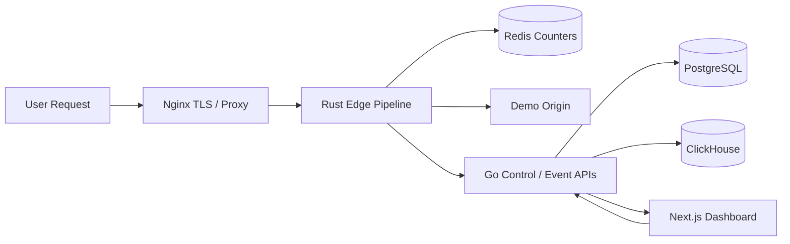
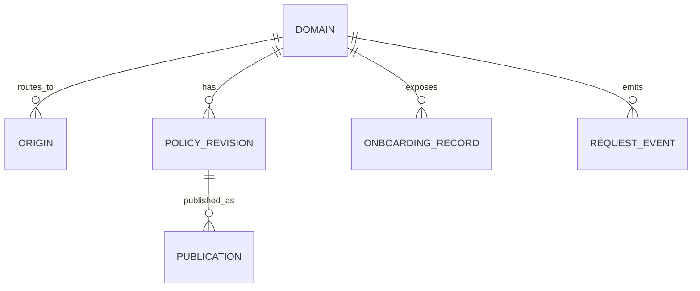

# feat: Evolve demo into stack-aligned CDN prototype

## Overview

Evolve the current CDN client demo into a more stack-aligned prototype that matches the intended product shape while preserving the existing buyer-facing proof loop. The target runtime split is:

- Rust for the edge proxy, cache, WAF, and request pipeline
- Go for the control plane, APIs, and supporting services
- TypeScript/Next.js for the dashboard and frontend
- Nginx as a temporary public edge, TLS terminator, or internal proxy
- PostgreSQL as the durable control-plane database
- Redis for counters and rate-limiting state
- ClickHouse for analytics and event storage
- Docker Compose for local deployment and rehearsal

The plan must keep the demo honest. It should become a more credible infrastructure prototype without pretending to be a global CDN, a production WAF, or a finished platform.

## Problem Statement / Motivation

The current demo already proves an important architecture split: TypeScript UI, Go control plane, and Rust edge decision path. That was enough to fix the earlier credibility gap, but it is still a narrow demo implementation:

1. Rust does edge-style decisioning, but it is not yet a real reverse proxy/cache pipeline.
2. Go owns all state in memory, so control-plane durability and revision authority are still demo-shaped.
3. Analytics are derived in-process rather than flowing through a dedicated analytics store.
4. There is no Nginx layer, no PostgreSQL, no Redis, no ClickHouse, and no Docker packaging.
5. The current request proof loop is strong, but it can easily be weakened if new infrastructure is added without preserving evidence clarity and precedence rules.

This next step matters because the client is evaluating long-term technical credibility. They want to see not only that the architecture split exists, but that the system is evolving in the right sequence: a real edge path in Rust, a real control plane in Go, durable state where it belongs, analytics in the right store, and packaging that another engineer can run. The plan should therefore optimize for staged realism, not for maximum component count on day one.

## Foundational Context

Found brainstorm from `2026-03-30`: `docs/brainstorms/2026-03-30-cdn-client-demo-brainstorm.md`.

Key decisions carried forward from the brainstorm:

- Keep the demo narrow and causal: `domain setup -> policy change -> request outcome -> analytics/quota`.
- Keep WAF and DNS basic; show product shape without implying full depth.
- Keep analytics first-class, but as part of the proof story, not an unrelated dashboard.
- Avoid pretending the platform already has mature global infrastructure.

## Proposed Solution

Implement the stack evolution in phases that preserve the current cache-proof demo at every step.

The resulting system should have these responsibilities:

- **Nginx** terminates TLS and forwards trusted request context to Rust.
- **Rust edge** receives real HTTP requests, enforces edge precedence, serves cache hits, fetches origin on misses, applies basic WAF and rate-limit decisions, and emits structured events.
- **Go control plane** owns domain onboarding, policy revisions, config publication, admin APIs, evidence retrieval APIs, and summary APIs.
- **PostgreSQL** becomes the source of truth for domains, origins, revisions, and durable control-plane state.
- **Redis** becomes the fast-path store for counters, rate limits, and short-lived coordination state.
- **ClickHouse** becomes the analytics/event store used for buyer-facing summaries and history.
- **Next.js** remains the buyer-facing dashboard and should continue to surface the same proof, logs, and analytics story with clearer backing systems.
- **Docker Compose** becomes the primary repeatable local deployment path for rehearsals and demos.

The plan intentionally stages these changes so the system remains demonstrable throughout. The first invariant is that the existing buyer-visible cache proof loop must continue to work after each phase.

## Problem Frame

This plan is not "replace the demo with the final architecture." It is "move the demo toward the final architecture in a way that improves technical credibility without losing the sales-quality walkthrough."

That means the plan must balance two truths:

- The architecture should become more real in the right places.
- The buyer-facing experience must stay simpler than the infrastructure behind it.

If the implementation becomes a many-service lab that weakens the proof loop, the plan fails even if the stack looks more impressive.

## Requirements Trace

- R1. Preserve the current core proof loop: domain config or onboarding, policy publication, live request outcome, evidence, and analytics/quota confirmation.
- R2. Move the request path toward a real Rust edge proxy/cache/WAF pipeline.
- R3. Move control-plane truth into Go backed by PostgreSQL.
- R4. Introduce Redis only for ephemeral fast-path state such as counters and rate limits, not as a source of truth.
- R5. Introduce ClickHouse for analytics/event ingest and buyer-facing summaries.
- R6. Introduce Nginx in a narrowly defined role as a temporary public edge, TLS terminator, or internal proxy.
- R7. Package the full local demo stack with Docker Compose.
- R8. Keep the onboarding, proof, logs, and analytics surfaces understandable to a buyer.
- R9. Keep the demo honest about what is live now versus future architecture.
- R10. Define explicit request precedence, activation, and truth-boundary rules so evidence remains consistent.

## Scope Boundaries

- Non-goal: global anycast network, POP replication, or multi-region traffic steering.
- Non-goal: production-grade managed DNS or certificate automation.
- Non-goal: enterprise WAF catalog, bot protection, DDoS mitigation, or advanced origin shielding.
- Non-goal: Kubernetes or production orchestration; Docker Compose is sufficient for this phase.
- Non-goal: turning the dashboard into a generic ops console.
- Non-goal: replacing the current buyer-facing proof loop with low-level infrastructure diagnostics.

## Local Research Summary

### Existing Repo Patterns

- TypeScript dashboard and frontend shell already exist under `app/`, `components/demo/`, and `lib/demo/service-client.ts`.
- Go control-plane APIs already exist in `api-go/internal/http/handlers.go` with a clear seam for domains, policy, logs, analytics, proofs, and internal edge endpoints.
- Go state authority is currently concentrated in `api-go/internal/state/store.go` and `api-go/internal/state/types.go`.
- Rust edge request behavior already exists in `edge-rust/src/main.rs` and `edge-rust/src/request_flow.rs`.
- Current service boundaries and claim guardrails are documented in `docs/demo/service-map.md`, `docs/demo/runbook.md`, and `docs/demo/demo-claims-guardrails.md`.
- Prior plans already encode the narrow-proof philosophy:
  - `docs/plans/2026-03-30-001-feat-cdn-demo-plan.md`
  - `docs/plans/2026-03-30-002-feat-rust-go-demo-clarity-plan.md`
  - `docs/plans/2026-03-31-003-feat-compose-onboarding-waf-plan.md`

### Institutional Learnings

- No `docs/solutions/` learnings were found in this repository.

## External References

- Rust HTTP stack:
  - axum: `https://docs.rs/axum/latest/axum/`
  - hyper guides: `https://hyper.rs/guides/1/`
  - reqwest: `https://docs.rs/reqwest/latest/reqwest/`
- HTTP semantics and caching:
  - RFC 9110: `https://www.rfc-editor.org/rfc/rfc9110`
  - RFC 9111: `https://www.rfc-editor.org/rfc/rfc9111`
  - RFC 5861: `https://www.rfc-editor.org/rfc/rfc5861`
- Nginx reverse proxy and TLS termination:
  - `https://docs.nginx.com/nginx/admin-guide/web-server/reverse-proxy/`
  - `https://docs.nginx.com/nginx/admin-guide/security-controls/terminating-ssl-http/`
- PostgreSQL current docs:
  - `https://www.postgresql.org/docs/current/`
- Redis counters and expiration:
  - `https://redis.io/docs/latest/commands/incr/`
  - `https://redis.io/docs/latest/commands/expire/`
- ClickHouse inserts and MergeTree guidance:
  - `https://clickhouse.com/docs/optimize/bulk-inserts`
  - `https://clickhouse.com/docs/engines/table-engines/mergetree-family/mergetree`
- Docker Compose startup, networking, and health checks:
  - `https://docs.docker.com/compose/how-tos/startup-order/`
  - `https://docs.docker.com/compose/how-tos/networking/`

## Key Technical Decisions

- Keep the current architecture split and evolve it, rather than introducing a separate second prototype. The repo already has the correct language boundaries; the plan should deepen them.
- PostgreSQL becomes the durable source of truth for domain, origin, onboarding, revision, and publication state. Go owns all writes to that state.
- Redis is strictly for fast-path ephemeral state such as rate limits, request counters, and temporary edge coordination. It does not own durable config or authoritative analytics.
- ClickHouse stores edge events and derived analytics data. Buyer-facing analytics should be served through Go APIs backed by ClickHouse, not directly from the browser.
- Nginx stays temporary and narrow. Its role must be explicit in docs and demo copy so it is not mistaken for the final CDN logic layer.
- Rust should continue to own the request path and should gradually move from edge-style evaluation to real reverse proxy behavior. When proxy fidelity or streaming matters, the long-term center of gravity should be `hyper`/`hyper-util`, even if `axum` remains useful for auxiliary endpoints.
- The dashboard should keep proof and logs primary, with analytics as confirmation. Adding ClickHouse must not invert that truth boundary.
- Define one canonical request precedence order and reuse it everywhere in code, docs, UI, and tests.
- Stage the migration so the current cache proof loop remains operational after each phase.

## SpecFlow Findings Incorporated

The specification analysis surfaced several gaps that this plan explicitly resolves:

- Define whether Nginx is buyer-visible or only infrastructure support.
- Define request precedence across pending, WAF, rate limit, quota, bypass, miss, and hit.
- Define what blocked requests count toward in quota, rate limits, and analytics.
- Define revision activation points and how mixed revisions are handled during publication.
- Define analytics freshness and whether ClickHouse is read directly or only through Go.
- Extend honesty boundaries so WAF, TLS, and analytics do not overclaim maturity.

## High-Level Technical Design

### Request Precedence

The plan standardizes request evaluation in this order:

1. Request normalization and trusted header extraction
2. Domain readiness / route eligibility
3. WAF rule evaluation
4. Rate limit evaluation
5. Quota evaluation
6. Cache eligibility and cache lookup
7. Origin fetch on miss or bypass
8. Cache store decision
9. Event/log emission

This ordering must be treated as an invariant. Proof panels, logs, counters, and analytics all depend on it.

### Truth Boundaries

- **Request proof** is the immediate truth for one request outcome.
- **Edge logs** are the immediate truth for why the Rust edge made that decision.
- **API/control logs** are the immediate truth for config publication, revision activation, and summary retrieval.
- **Analytics** are derived truth with bounded lag.
- **Architecture diagrams and stack descriptions** may describe the intended system, but must not imply all components are already operating at production depth.

### Revision Activation Rule

- A new policy revision is created and persisted in PostgreSQL by Go.
- Go marks the revision as published only after validation succeeds.
- Rust treats a revision as active only after it has fetched or received the published version.
- Request proof must show the revision actually applied to that request.
- Analytics may temporarily show a mix of revisions during transition, but the UI must not present that as inconsistency or failure.

## Data Model Direction

### Durable Control-Plane Entities

- Domain
- Origin
- DNS instruction set or onboarding record set
- Policy revision
- Publication status
- Tenant or demo project state

### Ephemeral/Counter State

- Rate-limit counters
- Short-lived quota counters used for enforcement
- Edge-local or Redis-backed coordination values

### Analytics/Event Entities

- Request event
- Cache outcome summary
- Block outcome summary
- Quota usage summary
- Buyer-facing aggregate tables or materialized summaries

## Implementation Phases

### Phase 1: Hardening the Current Multi-Service Demo

**Goal:** Make the existing Next.js + Go + Rust system container-safe and ready for stack evolution.

**Deliverables:**

- Externalize all inter-service URLs and remove hardcoded localhost assumptions.
- Add Dockerfiles and `docker-compose.yml` for the current stack.
- Add health checks, startup ordering, and a repeatable reset path.
- Keep the current cache proof loop unchanged.

**Why first:** The rest of the stack additions are easier and safer once the current system is portable and the service boundaries are explicit.

### Phase 2: Introduce Nginx as the Public Edge Boundary

**Goal:** Add a narrow Nginx layer for TLS termination and proxying without moving CDN logic out of Rust.

**Deliverables:**

- Add Nginx service and config.
- Define trusted forwarded-header policy.
- Ensure request IDs and trace IDs survive or are created consistently.
- Update runbook and claims docs to explain Nginx as temporary infrastructure, not final edge logic.

**Why second:** It introduces the real ingress boundary while keeping the Rust edge authoritative for request decisions.

### Phase 3: Move Control-Plane Truth into PostgreSQL

**Goal:** Replace the in-memory Go control-plane store with durable PostgreSQL-backed state.

**Deliverables:**

- Schema for domains, origins, onboarding state, revisions, and publication state.
- Repository/service layer in Go for durable reads and writes.
- Reset/reseed path for demo-safe setup.
- Migration of current dashboard and policy flows to PostgreSQL-backed APIs.

**Why third:** It gives the control plane a durable foundation before adding Redis and ClickHouse.

### Phase 4: Add Redis for Counters and Rate Limits

**Goal:** Move enforcement counters and rate limits out of in-memory Go logic into a fast-path store usable by the Rust edge.

**Deliverables:**

- Redis-backed rate-limit counters.
- Redis-backed or coordinated quota-enforcement counters, with clear truth-boundary rules against PostgreSQL and analytics summaries.
- Explicit precedence and accounting rules for blocked requests.

**Why fourth:** It introduces real edge-speed counters without making Redis authoritative for durable config.

### Phase 5: Upgrade Rust into a Real Edge Proxy/Cache Pipeline

**Goal:** Move from synthetic request evaluation to actual reverse-proxy behavior while preserving buyer clarity.

**Deliverables:**

- Real HTTP request handling beyond the current demo request endpoint.
- Origin fetch behavior with explicit timeout and error handling.
- Real cache object handling for response metadata and bodies.
- Basic WAF rule path on real requests.
- Structured event emission for all outcomes.

**Why fifth:** This is the biggest technical change and should happen after the system has stable ingress, durable config, and fast-path counters.

### Phase 6: Move Analytics to ClickHouse

**Goal:** Replace in-process analytics derivation with a dedicated analytics/event backend.

**Deliverables:**

- Append-oriented request event ingest.
- ClickHouse schema tuned for request/event summaries.
- Go summary APIs backed by ClickHouse.
- Explicit freshness states in the dashboard.

**Why sixth:** Analytics can lag slightly without breaking the request proof story, so this can follow the more critical request-path and state work.

### Phase 7: Reconcile Buyer-Facing Surfaces and Demo Ops

**Goal:** Ensure the dashboard, demo script, runbook, and evidence surfaces still tell one clear story after the stack evolution.

**Deliverables:**

- Updated onboarding flow and copy.
- Updated request proof, edge logs, API logs, and analytics messaging.
- Updated runbook, service map, and claims guardrails.
- Presentation readiness checklist for the multi-store stack.

## Implementation Units

- [x] **Unit 1: Externalize service configuration and package the current stack**

**Goal:** Make the current system container-safe and portable without changing its buyer-visible behavior.

**Requirements:** R1, R7, R8, R9

**Dependencies:** None

**Files:**
- Modify: `edge-rust/src/request_flow.rs`
- Modify: `api-go/cmd/server/main.go`
- Modify: `lib/demo/service-endpoints.ts`
- Modify: `package.json`
- Create: `Dockerfile.ui`
- Create: `api-go/Dockerfile`
- Create: `edge-rust/Dockerfile`
- Create: `docker-compose.yml`
- Modify: `docs/demo/runbook.md`

**Approach:**
- Replace fixed localhost service URLs with environment-driven configuration.
- Package the current UI, Go, and Rust services in Docker Compose with health checks and named services.
- Preserve the existing cache proof flow exactly as-is from the user’s perspective.

**Test scenarios:**
- Happy path: `docker compose up` starts the current system and the cache proof still works.
- Edge case: a late-starting dependency surfaces via health checks instead of silent failure.
- Error path: bad service configuration produces a bounded startup or API error.
- Integration: reset, policy publish, request proof, logs, and analytics still work under Compose.

**Verification:**
- Another engineer can run the existing demo path from Docker Compose without local toolchain choreography.

- [ ] **Unit 2: Add Nginx as the temporary ingress boundary**

**Goal:** Introduce a public-facing proxy/TLS layer while keeping CDN logic in Rust.

**Requirements:** R1, R2, R6, R7, R9, R10

**Dependencies:** Unit 1

**Files:**
- Create: `nginx/nginx.conf`
- Modify: `docker-compose.yml`
- Modify: `docs/demo/service-map.md`
- Modify: `docs/demo/demo-claims-guardrails.md`
- Modify: `docs/demo/runbook.md`

**Approach:**
- Terminate TLS or simulate the public edge in Nginx.
- Forward only trusted edge context to Rust.
- Define whether request IDs originate in Nginx or Rust, and document it.
- Keep Nginx out of the buyer-facing CDN logic story except where it explains ingress and TLS.

**Test scenarios:**
- Happy path: requests enter through Nginx and still produce Rust proof/log outcomes.
- Edge case: forwarded headers and client identity are preserved correctly.
- Error path: Nginx misconfiguration does not create misleading request metadata.
- Integration: dashboard and demo docs explain Nginx as temporary infra, not the final edge product.

**Verification:**
- The system has a credible ingress boundary without relocating request-policy logic out of Rust.

- [ ] **Unit 3: Persist control-plane state in PostgreSQL**

**Goal:** Make Go the durable control-plane authority using PostgreSQL.

**Requirements:** R1, R3, R8, R9, R10

**Dependencies:** Unit 1

**Files:**
- Modify: `api-go/internal/state/store.go`
- Modify: `api-go/internal/state/types.go`
- Modify: `api-go/internal/http/handlers.go`
- Create: `api-go/internal/db/`
- Create: `api-go/internal/domains/`
- Create: `api-go/internal/policy/`
- Create: `api-go/migrations/001_initial_control_plane.sql`
- Modify: `docs/demo/runbook.md`
- Create: `docs/demo/reset-and-reseed.md`

**Approach:**
- Introduce PostgreSQL tables for domains, origins, onboarding records, revisions, and publication state.
- Move Go write/read logic to PostgreSQL-backed repositories.
- Keep reset/reseed tooling explicit so the demo stays predictable.
- Preserve the same dashboard APIs where possible to reduce frontend churn.

**Test scenarios:**
- Happy path: domains and policy revisions survive service restart.
- Edge case: revision publication and activation remain consistent when multiple revisions exist.
- Error path: PostgreSQL unavailability surfaces as a bounded control-plane failure.
- Integration: the dashboard still shows onboarding, revision, logs, and proof using Go as the single authority.

**Verification:**
- Control-plane truth no longer depends on in-memory Go state.

- [ ] **Unit 4: Add Redis-backed rate limits and fast counters**

**Goal:** Introduce realistic fast-path enforcement state without moving durable authority out of PostgreSQL.

**Requirements:** R2, R4, R8, R10

**Dependencies:** Unit 3

**Files:**
- Modify: `edge-rust/src/request_flow.rs`
- Modify: `api-go/internal/http/handlers.go`
- Create: `api-go/internal/limits/`
- Create: `edge-rust/src/counters.rs`
- Modify: `services/shared/src/types.ts`
- Modify: `docs/demo/demo-claims-guardrails.md`

**Approach:**
- Use Redis for rate-limit windows and fast counters.
- Define explicitly whether blocked requests count toward quota, rate limits, and analytics.
- Keep Go responsible for configuration and buyer-facing summary APIs.

**Test scenarios:**
- Happy path: repeated requests increment counters and can trigger a buyer-visible limit state.
- Edge case: rate-limited requests do not create contradictory cache or quota outcomes.
- Error path: Redis unavailability degrades honestly and predictably.
- Integration: proof, logs, and analytics reflect the same counter-driven outcome categories.

**Verification:**
- The edge has realistic fast-path counters without creating durable-state confusion.

- [ ] **Unit 5: Upgrade Rust from edge evaluator to real reverse proxy/cache pipeline**

**Goal:** Make the Rust service handle real proxied traffic and cache objects instead of demo-only request decisions.

**Requirements:** R1, R2, R8, R10

**Dependencies:** Unit 2, Unit 3, Unit 4

**Files:**
- Modify: `edge-rust/src/main.rs`
- Modify: `edge-rust/src/request_flow.rs`
- Create: `edge-rust/src/proxy.rs`
- Create: `edge-rust/src/cache.rs`
- Create: `edge-rust/src/waf.rs`
- Create: `edge-rust/src/config.rs`
- Modify: `docs/demo/service-map.md`
- Modify: `docs/demo/logs-and-evidence-guide.md`

**Approach:**
- Accept real HTTP requests, not only synthetic request payloads.
- Implement explicit request normalization, cache eligibility, cache lookup, origin fetch, response handling, and event emission.
- Add one narrow WAF rule path on actual requests.
- Keep the buyer-facing proof surface compact even as the edge becomes more real.

**Test scenarios:**
- Happy path: first request is a miss, second identical request is a hit on real proxied traffic.
- Happy path: a matching WAF rule blocks the request before cache or origin handling.
- Edge case: pending domains, rate limits, and quota blocks follow the documented precedence.
- Error path: origin unavailability produces bounded proof/log outcomes rather than silent failure.
- Integration: revision IDs and request IDs remain traceable across Rust, Go, and analytics.

**Verification:**
- The Rust service is now a basic but credible edge proxy/cache/WAF pipeline.

- [ ] **Unit 6: Move analytics and event storage to ClickHouse**

**Goal:** Put analytics in the right system without weakening the immediate proof story.

**Requirements:** R1, R5, R8, R9, R10

**Dependencies:** Unit 5

**Files:**
- Create: `clickhouse/init/001_request_events.sql`
- Modify: `api-go/internal/http/handlers.go`
- Create: `api-go/internal/analytics/`
- Modify: `components/demo/analytics-page-shell.tsx`
- Modify: `components/demo/analytics-summary-cards.tsx`
- Modify: `app/analytics/page.tsx`
- Modify: `docs/demo/logs-and-evidence-guide.md`

**Approach:**
- Store append-oriented request events in ClickHouse.
- Expose analytics through Go APIs with explicit freshness semantics.
- Keep proof and logs primary when analytics are delayed.

**Test scenarios:**
- Happy path: request proof and logs are immediate, analytics update with bounded lag.
- Edge case: blocked outcomes are categorized distinctly in analytics.
- Error path: ClickHouse lag or downtime degrades analytics honestly without breaking request proof.
- Integration: dashboard analytics come from Go APIs backed by ClickHouse, not ad hoc in-memory summaries.

**Verification:**
- Analytics become architecture-aligned while preserving the existing evidence hierarchy.

- [ ] **Unit 7: Reconcile buyer-facing UX, docs, and demo operations**

**Goal:** Keep the evolved system understandable and presentation-safe.

**Requirements:** R1, R7, R8, R9, R10

**Dependencies:** Unit 1, Unit 2, Unit 3, Unit 4, Unit 5, Unit 6

**Files:**
- Modify: `app/domains/new/page.tsx`
- Modify: `components/demo/domain-onboarding-card.tsx`
- Modify: `components/demo/zone-detail-shell.tsx`
- Modify: `components/demo/request-proof-panel.tsx`
- Modify: `components/demo/edge-log-panel.tsx`
- Modify: `components/demo/api-log-panel.tsx`
- Modify: `docs/demo/demo-script.md`
- Modify: `docs/demo/demo-claims-guardrails.md`
- Modify: `docs/demo/runbook.md`
- Create: `docs/demo/presentation-readiness-checklist.md`

**Approach:**
- Refine onboarding to match the more durable control-plane flow.
- Keep proof, logs, and analytics legible to a buyer.
- Update presenter guidance to explain what Nginx, PostgreSQL, Redis, and ClickHouse add without dragging the presentation into low-level operations.

**Test scenarios:**
- Happy path: a presenter can onboard or select a domain, change policy, send traffic, and explain the evidence confidently.
- Edge case: delayed analytics or degraded infrastructure have a documented fallback narrative.
- Error path: service-specific failures do not cause the presenter to overclaim or improvise inaccurately.
- Integration: docs and UI tell the same truth about the architecture.

**Verification:**
- The evolved prototype remains a sales-quality demo rather than only an engineering lab.

## Alternative Approaches Considered

### 1. Keep the current demo and only add Compose

Rejected because it improves operability but not stack credibility. It does not move durable state, analytics, or the edge path toward the intended architecture.

### 2. Jump straight to all target components at once

Rejected because it introduces too much integration risk at once and is likely to break the current proof loop, which is the strongest part of the demo.

### 3. Move analytics before the real edge pipeline

Rejected because the immediate buyer value still depends more on the request path than on analytics backend sophistication.

### 4. Use Nginx as the long-term edge logic layer

Rejected because it conflicts with the explicit architecture direction that Rust should own edge logic.

## Acceptance Criteria

### Functional Requirements

- [ ] The system can be started locally through Docker Compose.
- [ ] The dashboard continues to show one coherent proof path from config to request to evidence.
- [ ] Go persists control-plane state in PostgreSQL.
- [ ] Rust enforces a documented request precedence order.
- [ ] Nginx forwards trusted ingress traffic without becoming the CDN logic layer.
- [ ] Redis-backed counters can drive at least one buyer-visible enforcement path.
- [ ] ClickHouse-backed analytics are available through Go summary APIs.
- [ ] Request proof, edge logs, API logs, and analytics correlate by stable request or trace IDs.

### Non-Functional Requirements

- [ ] The demo remains honest about what is production-ready versus product-direction architecture.
- [ ] Analytics freshness is explicitly surfaced when not immediate.
- [ ] Reset/reseed behavior is documented across all backing systems.
- [ ] Inter-service networking no longer depends on hardcoded localhost assumptions.

### Quality Gates

- [ ] Each phase preserves the current cache proof loop before the next phase begins.
- [ ] Request precedence is documented in code-facing docs and presenter docs.
- [ ] Failure modes for PostgreSQL, Redis, ClickHouse, and Nginx are represented as bounded demo states.
- [ ] Documentation is updated for service map, runbook, evidence interpretation, and claim guardrails.

## Success Metrics

- Another engineer can run the stack with Docker Compose and follow the runbook without private context.
- A technical buyer can identify the role of Rust, Go, TypeScript, Nginx, PostgreSQL, Redis, ClickHouse, and Docker from the product and documentation surfaces.
- The main demo still shows a convincing `config -> edge outcome -> evidence -> analytics` story.
- The architecture story becomes more credible without making the presentation harder to follow.

## Dependencies & Prerequisites

- Docker and Docker Compose available in the target demo environment.
- A clear decision on whether the initial Nginx layer is demo-visible or only operational.
- Agreement that PostgreSQL becomes durable authority before broader edge/runtime complexity is added.
- Agreement that ClickHouse remains analytics-only, not a control-plane dependency.

## Risk Analysis & Mitigation

| Risk | Mitigation |
|------|------------|
| New infrastructure breaks the existing proof loop | Phase the work and require the current cache proof to pass after each stage |
| The stack becomes more impressive but less understandable | Keep proof and logs primary, and move deeper infrastructure detail into docs and presenter notes |
| Contract drift appears across TypeScript, Go, and Rust | Treat shared request/policy/proof fields as a first-class contract and update all three runtimes together |
| Redis is misused as a source of truth | Restrict Redis to counters and ephemeral state only |
| ClickHouse introduces analytics lag that looks like inconsistency | Keep analytics explicitly derived-with-lag and rely on proof/logs as immediate truth |
| Nginx muddies the architecture story | Document it as temporary ingress/TLS infra rather than the long-term edge logic layer |
| PostgreSQL migration destabilizes demo setup | Add reset/reseed tools and keep APIs stable while swapping storage underneath |
| Rust proxy behavior becomes much more complex than the UI story | Keep the UI compact and expose only the buyer-relevant evidence fields |

## Resource Requirements

- One engineer comfortable with Rust request-path work
- One engineer comfortable with Go service and data-layer work
- One engineer comfortable with TypeScript/Next.js dashboard updates
- Time for integration testing across Docker, Nginx, PostgreSQL, Redis, and ClickHouse

## Documentation Plan

- Update `docs/demo/service-map.md` after each major infrastructure boundary changes.
- Update `docs/demo/runbook.md` with startup, reset, and fallback instructions for the new stack.
- Update `docs/demo/demo-claims-guardrails.md` so the demo never overclaims WAF, analytics, DNS, TLS, or global scale.
- Add a presentation readiness checklist for the multi-store, multi-service stack.

## References & Research

### Internal References

- Brainstorm: `docs/brainstorms/2026-03-30-cdn-client-demo-brainstorm.md`
- Existing architecture plan: `docs/plans/2026-03-30-002-feat-rust-go-demo-clarity-plan.md`
- Existing Compose/onboarding/WAF plan: `docs/plans/2026-03-31-003-feat-compose-onboarding-waf-plan.md`
- Current service map: `docs/demo/service-map.md`
- Current runbook: `docs/demo/runbook.md`
- Current claim guardrails: `docs/demo/demo-claims-guardrails.md`
- Current Go API layer: `api-go/internal/http/handlers.go`
- Current Go state authority: `api-go/internal/state/store.go`
- Current Rust request path: `edge-rust/src/request_flow.rs`
- Current Rust entrypoint: `edge-rust/src/main.rs`
- Current frontend service client: `lib/demo/service-client.ts`

### External References

- axum docs: `https://docs.rs/axum/latest/axum/`
- hyper guides: `https://hyper.rs/guides/1/`
- reqwest docs: `https://docs.rs/reqwest/latest/reqwest/`
- RFC 9110: `https://www.rfc-editor.org/rfc/rfc9110`
- RFC 9111: `https://www.rfc-editor.org/rfc/rfc9111`
- RFC 5861: `https://www.rfc-editor.org/rfc/rfc5861`
- Nginx reverse proxy docs: `https://docs.nginx.com/nginx/admin-guide/web-server/reverse-proxy/`
- Nginx TLS termination docs: `https://docs.nginx.com/nginx/admin-guide/security-controls/terminating-ssl-http/`
- PostgreSQL docs: `https://www.postgresql.org/docs/current/`
- Redis `INCR`: `https://redis.io/docs/latest/commands/incr/`
- Redis `EXPIRE`: `https://redis.io/docs/latest/commands/expire/`
- ClickHouse bulk inserts: `https://clickhouse.com/docs/optimize/bulk-inserts`
- ClickHouse MergeTree: `https://clickhouse.com/docs/engines/table-engines/mergetree-family/mergetree`
- Docker Compose startup order: `https://docs.docker.com/compose/how-tos/startup-order/`
- Docker Compose networking: `https://docs.docker.com/compose/how-tos/networking/`
