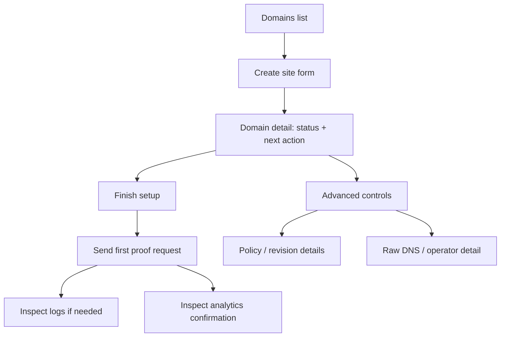

# feat: Simplify CDN Onboarding Flow

## Overview

Simplify the current onboarding and setup experience so a user can move from `"I created a site"` to `"I saw first proof through the CDN"` without parsing multiple competing cards, conflicting state labels, or architecture-heavy detail.

This plan is a focused follow-up to `docs/plans/2026-03-31-feat-real-user-cdn-onboarding-flow-plan.md`. That earlier plan established the end-to-end real-user setup journey. This plan narrows in on information architecture, copy, progressive disclosure, and screen hierarchy so the existing implementation becomes easier to follow.

## Problem Frame

The current onboarding flow contains the right building blocks, but too many of them appear at the same level:

- `/domains` mixes existing-site state, implementation-facing quick-start choices, and demo-driven query params.
- `/domains/new` asks the user to choose internal setup details such as `Initial verification state` too early.
- `/domains/[domainId]` gives setup, policy, state glossary, proof, logs, and analytics equal weight on first load.
- Setup state language is inconsistent across cards: `ready`, `ready to activate`, `activation`, `verification`, `live proof`, and revision/apply state compete instead of guiding one next action.

The result is a workspace that is technically rich but cognitively noisy. The product currently asks the user to understand configuration, verification, and observability all at once.

## Requirements Trace

- R1. The onboarding flow must have one dominant path to first success: create site -> finish setup -> send first proof request.
- R2. Each primary screen must have one main job and one dominant next action.
- R3. Setup/configuration, proof, logs, and analytics must appear in a clear sequence instead of as equal peers.
- R4. Simplification must preserve honesty boundaries: request proof stays the immediate truth, logs explain it, analytics confirm it.
- R5. The plan should reuse the current routes and components where possible instead of replacing the product structure wholesale.
- R6. The implementation must follow strict accessibility (a11y) standards, maintaining keyboard navigation and screen-reader focus management (especially during setup step transitions).
- R7. The implementation must maintain responsive integrity, stacking multi-column setups gracefully on mobile breakpoints and persisting blockers near the top of the viewport.

## Scope Boundaries

- Non-goal: redesigning auth, origin validation, DNS verification, or backend domain-state logic beyond what is needed to support clearer presentation.
- Non-goal: removing proof, logs, analytics, or policy controls from the product entirely.
- Non-goal: introducing a brand-new route tree unless the existing route structure proves insufficient during implementation.
- Non-goal: hiding demo honesty details in a way that overclaims current product maturity.

## Context & Research

### Relevant Code and Patterns

- `app/domains/page.tsx`: authenticated entry into the domains list.
- `app/domains/new/page.tsx`: current onboarding form entry point.
- `app/domains/[domainId]/page.tsx`: detail route that currently loads the full workspace at once.
- `components/demo/domains-shell.tsx`: list page copy, quick-start options, and first-step messaging.
- `components/demo/new-domain-form.tsx`: current create-site form and early setup choices.
- `components/demo/zone-detail-shell.tsx`: main orchestration layer for setup, proof, logs, and analytics.
- `components/demo/domain-onboarding-card.tsx`: top-level setup summary and status framing.
- `components/demo/domain-config-sections.tsx`: overloaded config/edit/verification/DNS surface.
- `components/demo/domain-state-timeline.tsx`: current state glossary that explains but does not guide.
- `components/demo/cache-policy-card.tsx`: policy publishing control that should remain available but not dominate onboarding.
- `components/demo/evidence-tabs.tsx`: proof/logs container.
- `components/demo/request-proof-panel.tsx`: current first-proof messaging.
- `components/demo/analytics-page-shell.tsx`: confirmation surface with explicit freshness language.
- `services/shared/src/types.ts`: existing state fields that the UI must translate consistently.

### Institutional Learnings

- `docs/plans/2026-03-31-feat-real-user-cdn-onboarding-flow-plan.md`: the broader onboarding plan already established the intended user journey and the rule that proof/logs are immediate truth while analytics are confirmation.
- `docs/demo/logs-and-evidence-guide.md`: each evidence surface should answer one question only.
- `docs/demo/demo-claims-guardrails.md`: seeded or pre-verified states must not be presented as discovered live.
- `docs/demo/presentation-readiness-checklist.md`: keep the main narrative anchored on `config -> proof -> logs -> analytics`.

### External References

- None. Local repo context and current project files are sufficient for this planning pass.

## Key Technical Decisions

- Treat this as an information-architecture simplification first, not a backend-state expansion task.
  Rationale: the current confusion comes mainly from presentation order, copy conflicts, and equal-weight layout rather than from a missing API.

- Introduce a dedicated onboarding route (`/domains/[domainId]/setup`).
  Rationale: Overloading the persistent `/domains/[domainId]` detail page to act as a single-threaded wizard hurts steady-state observability. Separating the first-time setup flow protects the main detail page for ongoing configuration management.

- Map backend states explicitly rather than masking them in display logic.
  Rationale: If the UI unifies states too heavily and masks backend complexity, debugging becomes impossible (e.g., UI says "Ready" but backend is stuck). Explicit mapping prevents state desync.

- Hide demo-assisted and verification-state shortcuts behind an admin flag or `/admin` route.
  Rationale: Keeping demo tools in the user-facing UI (even if secondary) adds unnecessary complexity and risks confusing real users.

- Use progressive disclosure instead of deletion for technical detail.
  Rationale: the project still needs demo credibility and reviewer depth. Advanced evidence and demo-specific affordances should be secondary, not removed.

- Unify user-facing state language in display components rather than leaking raw internal terms into multiple cards.
  Rationale: the current mix of `ready`, `activate`, `verification`, and `proof` language is confusing even when the underlying state is correct.

## Open Questions

### Resolved During Planning

- Should this plan add new backend workflows before simplifying the UI?
  Resolution: No. Default to presentation-layer simplification first and only add lightweight UI-facing helpers if the current state model needs a clearer mapping.

- Should proof, logs, and analytics remain on the detail page?
  Resolution: Yes, but they should no longer compete with the primary setup path on initial view.

- Should advanced/demo-assisted setup branches remain visible?
  Resolution: Yes, but they should be visually secondary to the normal first-success path.

### Deferred to Implementation

- Whether the cleanest implementation is a reordered `ZoneDetailShell` only or a small split into additional focused UI cards.
  Why deferred: the right boundary depends on how much JSX simplification is achievable without creating redundant wrapper components.

- Whether state-copy mapping belongs inline in existing components or in a small shared display helper.
  Why deferred: this is an implementation ergonomics decision, not a planning blocker.

## High-Level Technical Design

> *This illustrates the intended approach and is directional guidance for review, not implementation specification. The implementing agent should treat it as context, not code to reproduce.*

## Implementation Units

- [ ] **Unit 0: Define unified user-facing state vocabulary**

**Goal:** Establish the ubiquitous language for states *before* rebuilding any UI components.

**Requirements:** R2
**Dependencies:** None
**Approach:** Define the exact mapping from internal backend states (`services/shared/src/types.ts`) to the new unified user-facing labels to ensure UI implementation in subsequent units is consistent.

- [ ] **Unit 1: Simplify entry points and first-step messaging**

**Goal:** Make `/domains` and `/domains/new` feel like a guided start rather than a collection of implementation choices.

**Requirements:** R1, R2, R5

**Dependencies:** None

**Files:**
- Modify: `app/domains/page.tsx`
- Modify: `app/domains/new/page.tsx`
- Modify: `components/demo/domains-shell.tsx`
- Modify: `components/demo/new-domain-form.tsx`
- Test: `tests/demo/dashboard-flow.test.tsx`
- Test: `tests/demo/new-domain-form.test.tsx`

**Approach:**
- Reduce the domains list hero and quick-start area to one clear recommendation and one secondary alternative.
- Remove or visually demote implementation-facing controls from the create form when they are not necessary for the first-success path.
- Reframe form copy around the next immediate outcome: create the site, then continue into setup.
- Keep demo-assisted and verification-state shortcuts available only as secondary or advanced affordances if they are still needed for internal demos.

**Patterns to follow:**
- Reuse the existing authenticated route structure in `app/domains/page.tsx` and `app/domains/new/page.tsx`.
- Preserve the current form/test style already used in `components/demo/new-domain-form.tsx` and `tests/demo/new-domain-form.test.tsx`.

**Test scenarios:**
- Happy path: the domains page presents one dominant primary CTA for starting onboarding.
- Happy path: the create form shows only the minimum inputs needed for the standard first-success setup path.
- Edge case: secondary/advanced onboarding options remain reachable without dominating the default form.
- Error path: failed site creation still surfaces a clear error without reintroducing extra explanatory clutter.
- Integration: creating a site still routes the user into the domain detail workspace for the newly created domain.

**Verification:**
- A new user can understand what to do from `/domains` and `/domains/new` without needing to interpret demo-specific query-param or verification jargon.

- [ ] **Unit 2: Rebuild the domain detail page around one next action**

**Goal:** Turn the zone detail page into a guided setup workspace with a dominant current step, blocker, and next action.

**Requirements:** R1, R2, R3, R5

**Dependencies:** Unit 1

**Files:**
- Modify: `app/domains/[domainId]/page.tsx`
- Modify: `components/demo/zone-detail-shell.tsx`
- Modify: `components/demo/domain-onboarding-card.tsx`
- Modify: `components/demo/domain-config-sections.tsx`
- Modify: `components/demo/domain-state-timeline.tsx`
- Test: `tests/demo/domain-config-sections.test.tsx`
- Create: `tests/demo/zone-detail-shell.test.tsx`

**Approach:**
- Reorder the top of the page so it answers three questions first: what state is this site in, what is blocking progress, and what should the user do next.
- Define a strict precedence hierarchy for surfacing blockers (e.g., 1. DNS Verification, 2. Origin Validation) so there is always exactly one dominant next action, even if multiple backend conditions are pending.
- Convert the current state timeline from a glossary-style explainer into a progress-oriented companion or secondary detail.
- Split the current overloaded config surface into clearer sub-sections or smaller cards: current status, editable setup, DNS verification, and advanced detail. Use explicit interaction patterns for secondary content (e.g., accordions for advanced DNS settings) instead of vague "visual demotion."
- Include explicit loading states for async operations (e.g., skeleton loaders during DNS/origin validation) and empty states for the domains list.
- Keep raw DNS records and operator-oriented detail present, but behind clear interactions like a "Show Advanced" toggle or a slide-over panel.

**Patterns to follow:**
- Preserve the current route shell and data-loading pattern in `app/domains/[domainId]/page.tsx`.
- Reuse existing domain fields from `services/shared/src/types.ts` rather than inventing a new parallel view model unless clearly needed.

**Test scenarios:**
- Happy path: the detail page leads with current status and one dominant next action.
- Happy path: a setup-in-progress domain highlights the blocking step before showing proof or analytics detail.
- Edge case: a ready domain still exposes proof and policy controls without duplicating contradictory status messaging.
- Error path: failed origin validation or blocked DNS state remains visible and actionable after the layout simplification.
- Integration: the top-level detail layout still renders domain summary, setup controls, and evidence in the intended sequence.

**Verification:**
- The domain detail page reads like a guided flow instead of a toolbox, and the first required action is visually obvious on first load.

- [ ] **Unit 3: Sequence proof, logs, and analytics after setup completion**

**Goal:** Preserve the evidence story while making proof the first-success moment and logs/analytics the secondary confirmation layers.

**Requirements:** R3, R4

**Dependencies:** Unit 2

**Files:**
- Modify: `components/demo/zone-detail-shell.tsx`
- Modify: `components/demo/evidence-tabs.tsx`
- Modify: `components/demo/request-proof-panel.tsx`
- Modify: `components/demo/analytics-page-shell.tsx`
- Test: `tests/demo/request-proof-panel.test.tsx`
- Create: `tests/demo/evidence-tabs.test.tsx`

**Approach:**
- Make request proof the first evidence surface the user encounters once setup is ready enough to test.
- Define explicit failure paths: if proof fails, automatically elevate error logs directly to the primary view instead of burying them in a drill-down.
- Demote edge logs and API logs into specific UI containers (e.g., a "View Logs" slide-over panel or accordion) behind proof instead of equal-first tabs when proof succeeds.
- Keep analytics visible as confirmation, but place it below the fold or inside an explicitly secondary "Metrics" section when the user is still seeking first success.

**Patterns to follow:**
- Follow the evidence ordering already documented in `docs/demo/logs-and-evidence-guide.md` and `docs/demo/presentation-readiness-checklist.md`.
- Preserve analytics freshness honesty from `components/demo/analytics-page-shell.tsx`.

**Test scenarios:**
- Happy path: a ready domain leads the user to send a proof request before exploring logs or analytics.
- Happy path: after proof exists, logs remain accessible as explanatory detail for the same request.
- Edge case: a pending domain still shows blocked-proof messaging honestly without suggesting the site is live.
- Error path: request failure messaging remains clear and localized to the proof surface.
- Integration: proof remains the immediate truth even when analytics freshness is `updating` or `degraded`.

**Verification:**
- The evidence story feels sequential: proof first, then logs if needed, then analytics as confirmation.

- [ ] **Unit 4: Unify user-facing state language and reduce copy collisions**

**Goal:** Eliminate contradictory terminology across badges, setup cards, proof copy, and action labels.

**Requirements:** R2, R3, R4

**Dependencies:** Units 2 and 3

**Files:**
- Modify: `components/demo/domain-readiness-badge.tsx`
- Modify: `components/demo/domain-onboarding-card.tsx`
- Modify: `components/demo/domain-config-sections.tsx`
- Modify: `components/demo/request-proof-panel.tsx`
- Modify: `components/demo/cache-policy-card.tsx`
- Modify: `docs/demo/presentation-readiness-checklist.md`
- Test: `tests/demo/dashboard-flow.test.tsx`
- Test: `tests/demo/domain-config-sections.test.tsx`
- Test: `tests/demo/request-proof-panel.test.tsx`

**Approach:**
- Define one user-facing vocabulary for the current onboarding slice and apply it consistently across primary cards and buttons.
- Deemphasize `truthLabel` and other demo/meta terminology in primary onboarding UI while preserving honesty where it matters.
- Align policy/publish/apply wording so it supports the setup journey rather than introducing a separate parallel narrative.
- Update demo/readiness documentation to match the simplified surface order and terminology.

**Patterns to follow:**
- Keep claims aligned with `docs/demo/demo-claims-guardrails.md`.
- Follow the existing compact card and badge patterns already used in the demo UI.

**Test scenarios:**
- Happy path: badges, setup copy, and proof copy use consistent language for the same domain state.
- Edge case: blocked or pending flows use honest but simpler wording instead of exposing conflicting activation/readiness terms.
- Error path: failure messages remain explicit without leaking extra operator jargon.
- Integration: the revised copy still matches the actual behavior of proof, logs, analytics, and policy actions.

**Verification:**
- A reviewer can read the onboarding flow end-to-end without encountering conflicting labels for the same state transition.

## System-Wide Impact

- **Interaction graph:** `/domains` -> `/domains/new` -> `/domains/[domainId]` remains the primary route flow. `ZoneDetailShell` continues to orchestrate setup controls, policy changes, proof, logs, and analytics.
- **Error propagation:** origin and DNS errors should stay visible in the setup path rather than being buried under secondary evidence surfaces.
- **State lifecycle risks:** simplifying the UI must not imply a domain is live before proof succeeds, and must not blur the difference between saved config, active revision, and observed proof.
- **API surface parity:** the plan should preserve existing Go/Next/Rust endpoint contracts unless a tiny UI-facing helper becomes clearly necessary.
- **Integration coverage:** the key cross-layer scenario remains `create site -> update setup -> send proof -> inspect logs -> confirm analytics freshness`.
- **Unchanged invariants:** request proof remains the immediate truth, analytics freshness semantics remain intact, and demo honesty constraints remain unchanged.

## Risks & Dependencies

| Risk | Mitigation |
|------|------------|
| Simplification hides details the demo still needs | Use progressive disclosure instead of deleting technical surfaces outright |
| Copy becomes cleaner but drifts away from real system behavior | Ground all user-facing language in the existing domain/proof/analytics states and preserve honesty guardrails |
| Reordering the detail page creates regressions in existing interactions | Add focused component tests for the detail shell, config card, and proof surfaces |
| The create flow still leaks implementation jargon through legacy controls | Make advanced/demo shortcuts explicitly secondary and keep the default path minimal |

## Documentation / Operational Notes

- Update `docs/demo/presentation-readiness-checklist.md` if the primary walkthrough order or button labels change.
- If implementation significantly changes the narrated walkthrough, refresh `docs/demo/demo-script.md` to match the simplified onboarding story.

## Sources & References

- Related plan: `docs/plans/2026-03-31-feat-real-user-cdn-onboarding-flow-plan.md`
- Related code: `components/demo/domains-shell.tsx`
- Related code: `components/demo/new-domain-form.tsx`
- Related code: `components/demo/zone-detail-shell.tsx`
- Related code: `components/demo/domain-config-sections.tsx`
- Related code: `components/demo/evidence-tabs.tsx`
- Internal guidance: `docs/demo/logs-and-evidence-guide.md`
- Internal guidance: `docs/demo/demo-claims-guardrails.md`
- Internal guidance: `docs/demo/presentation-readiness-checklist.md`
